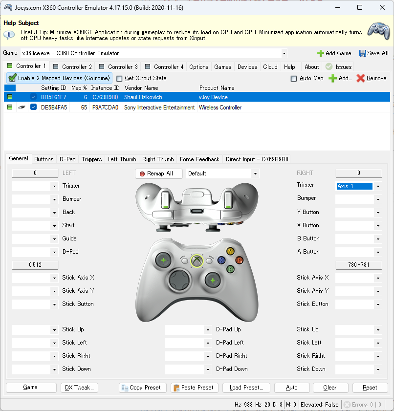
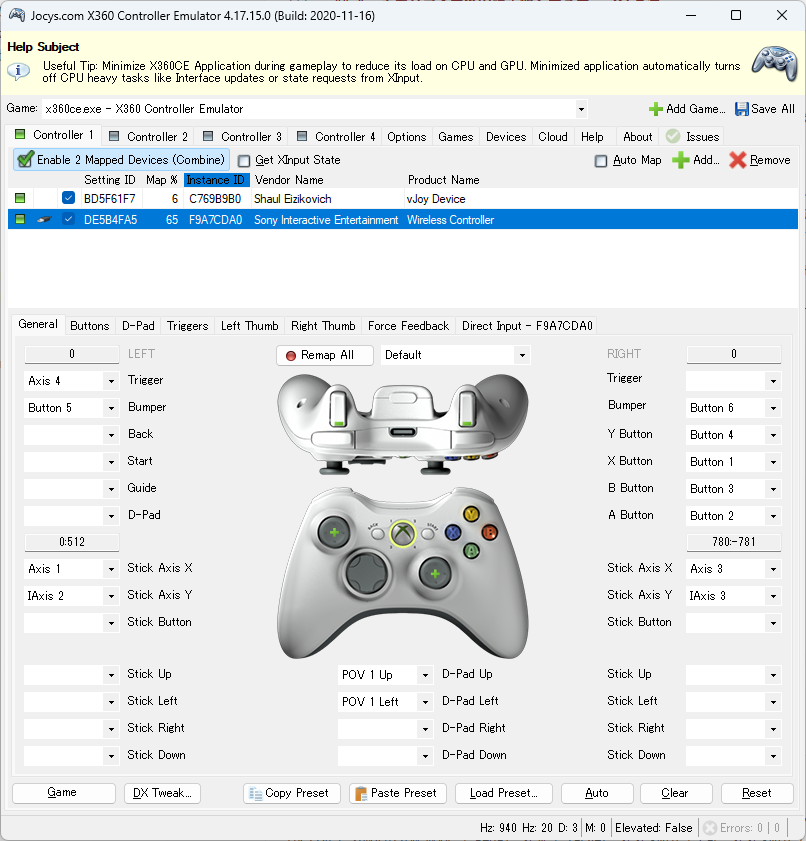

# Smart Trainer Bridge (HorizonCycling)

スマートローラートレーナーとレースゲームを双方向で接続し、現実のペダリングによるゲーム内の車の運転と、ゲーム内の地形変化（斜度）に応じたローラー負荷の自動再現を両立する、.NET 8.0 ベースの Windows 用中継アプリケーション（ミドルウェア）です。

実走感にこだわった物理シミュレーションと、ゲームの自動操舵アシストを活かすためのインテリジェントなアシスト機能を搭載しており、圧倒的に没入感の高いバーチャルサイクリング／ドライブ体験を提供します。


---

## ⚠️ 【最重要】免責事項 (Disclaimer)

* **本アプリは、Microsoft Corporation、Xbox Game Studios、Playground Games、および各種スマートローラーメーカー（CYCPLUS、Wahoo、Tacx、Zwift等）とは一切関係のない、個人が開発した「非公式のファンメイドツール（Not affiliated with Microsoft / Playground Games）」です。**
* 本アプリの使用によって生じたハードウェアの破損、ゲームアカウントのBAN（利用停止）や制限、PC環境の不具合、事故、ケガ、その他のいかなる損害についても、開発者は一切の責任を負いません。すべて**自己責任**でご利用ください。

---

## ⚠️ 一般公開時・ご利用における注意点

本アプリを安全に利用・公開し、権利侵害などのトラブルに巻き込まれないために、以下の項目を必ず遵守・ご理解ください。

### 1. 商標とロゴの取り扱いについて
* 本アプリは「Forza Horizonシリーズ等のデータアウト（テレメトリ）機能に対応」していますが、公式ツールではありません。
* アプリ名に「Forza Horizon」などの公式商標を直接含めたり、公式のロゴや画像をアプリのアイコン・配布ページに使用したりすると、商標権の侵害となり警告・公開停止を受ける可能性が非常に高いです。
* 本ツールは独自のオリジナル名称 **「Smart Trainer Bridge (HorizonCycling)」** として公開し、説明文で対応ゲーム（データアウト機能に対応）について言及するレベルに留めています。

### 2. 収益化（販売）について
* Microsoftの「ゲーム コンテンツ利用規約」において、ゲームのデータや知的財産（IP）に依存したツールを有料で販売して利益を得ることに対しては非常に厳格です。
* 本ツールは**完全無料（オープンソース）**で公開しており、商用利用や有料での再配布は一切禁止とします。開発維持のための寄付（ドネーション）を募る程度に留める必要があります。

### 3. アンチチートシステムへの配慮
* 本アプリの動作に必要な仮想入力ドライバー（vJoy）やエミュレーター（x360ce）は、オンラインのマルチプレイや競技モードにおいて、ゲーム側のアンチチートシステム（EAC等）から「不正ツール（チートツール）」と誤検知されるリスクがゼロではありません。
* **オンライン対戦やランキングに影響するモードでの本ツールの使用は完全に自己責任となります。** 不正検知トラブルを防ぐため、オンライン競技時は本ツールの使用を控えるか、オフラインのソロドライブ・フリーランで楽しむことを強く推奨します。

---

## 🚀 主な機能と特徴

### 1. ２つの動作モード
* **シミュレーションモード (Simulation Mode) [推奨]**
  ライダーと自転車の物理モデル（総重量、重力、空気抵抗、転がり抵抗、チェーン効率）に基づいて「本来自転車であれば出るはずの目標速度」を毎フレームリアルタイムに計算し、車の速度がその速度に追従するように **PID制御** でアクセルを細かく自動コントロールします。

  > [!NOTE]
  > **💡 PID制御とは？**
  > 本アプリが算出する「自転車の目標速度」に、ゲーム内の「車の速度」をぴったり一致させるための自動スロットル（アクセル）調整システムです。
  > * **P (比例: Proportional)**: 現在の速度差が大きいほど、アクセルを強く踏み込みます（基本的な加速）。
  > * **I (積分: Integral)**: 上り坂などで目標速度に届かない状態が続くと、徐々にアクセルを強く踏み増します（失速・タレの防止）。
  > * **D (微分: Derivative)**: 目標速度に急激に近づいたとき、アクセルを適度に緩めて行き過ぎやギクシャク感を抑えます（滑らかな走行の維持）。
  > 
  > この3つの要素を1秒間に何十回も計算・調整することで、滑らかで自然なペダリング追従を実現しています。

* **アーケードモード (Arcade Mode)**
  ペダリングパワー（W）を基準パワー（FTP: Functional Threshold Power）で割り、車のアクセル開度（0〜100%）にダイレクトに反映させるシンプルな直感的操作モードです。

### 2. 没入感を高めるスマートアシスト
* **下り坂での自動滑走アシスト（オートパイロット）**
  実車同様に、下り坂に入ると足を止めても重力によって車がスルスルと自動加速します。また、Forzaの「アクセルON時のみ機能する自動操舵アシスト」が切れてコースアウトするのを完璧に防ぎます。
* **仮想ギアダウン機能（車の限界によるペダル負荷軽減）**
  非力な車を運転している際、登り坂で車のパワーが足りずに減速した際、ペダルが異様に重くなって漕ぎ続けられなくなる現象を防ぐため、車速の低下に合わせて「自動で軽いギアに変速する」ようにスマートローラーへ送信する斜度を自動で下げるアシストを行います。
* **平地・下り坂での完全スピンフリー（無負荷）化**
  スマートローラーの仕様による「斜度0%でも高速回転時に発生する重い空気抵抗」を完全にシャットアウトするため、送信斜度が0%以下の局面では物理抵抗レベル自体を強制的に「0 (完全フリー)」に切り替えます。これにより、下り坂で足を高速回転させた際のスカスカと軽い滑走感を実現しています。
* **サスペンション姿勢沈み込み・加減速ノイズの相殺**
  Forzaのテレメトリ姿勢角に含まれる、車の加速・減速時のノイズや空気抵抗によるフロントの浮き（約 -0.9% 程度の定常オフセット）を数学的に相殺し、平地を走っている時はペダルが完全にフラット（0%）になるよう補正します。
* **漕ぎ出し発進アシスト＆激坂デッドロック防止**
  坂道の途中で停車または極低速（3.0 km/h以下）になった際、スマートローラーの重い斜度負荷を強制的に `0%` に解放し、軽い漕ぎ出しでのスムーズな発進をアシストします。また、自転車物理エンジンには本来の斜度を伝える疎結合設計により、アシストによるペダル解放状態からの登坂デッドロックを完全に防止しています。

---

## 🛠 必要環境と前提ツール

本アプリを使用するには、以下のハードウェアおよびソフトウェア環境が必要です。

### 1. ハードウェア要件
* **Windows OS PC**: Windows 10 または 11（Bluetooth LE 機能が搭載されていること）
* **FTMS対応スマートローラートレーナー**: BLE（Bluetooth Low Energy）の標準FTMSプロトコルに準拠したスマートローラー。
  * *動作確認済み機材*: **CYCPLUS T2**、Wahoo Kickr、Tacx Neo、Zwift Hub等
  * *注意*: Bluetooth LE接続のみ対応しています。ANT+通信には対応していません。
* **対応ゲーム**: UDPデータアウトプット（テレメトリ送信）機能を備えたレースゲーム（例：Forza Horizon6でのみ動作確認済み）

### 2. 必要ソフトウェア・ツール
本アプリがペダリングパワーをゲーム内車の入力へ変換し、ゲーム内斜度をローラーへ反映するために、以下のツールを事前にセットアップする必要があります。

* **.NET 8.0 Runtime**: アプリケーションの実行に必要です。
* **vJoy (Virtual Joystick) [推奨フォーク版]**: 仮想ジョイスティックドライバー。
  * ※重要：公式サイト（sourceforge）の古いオリジナル版（v2.1.8等）は最新のWindows 10/11の署名要件に対応しておらず、インストール中にPCのフリーズや再起動ループを引き起こすトラブルが多発します。必ず下記の**有志による修正フォーク版**を導入してください。
  * [jshafer817氏によるvJoyフォーク版 (v2.1.9.1)](https://github.com/jshafer817/vJoy/releases) または [njz3氏によるvJoyフォーク版](https://github.com/njz3/vJoy/releases) を強く推奨します。
* **x360ce (Xbox 360 Controller Emulator)**: vJoy入力をXbox 360コントローラー入力に変換するエミュレーター。
  * ※重要：ForzaシリーズなどのゲームはvJoyのようなDirectInputデバイスを直接認識しづらいため、x360ceを介して「Xbox 360 コントローラー」として偽装してゲームに認識させる必要があります。
  * [x360ce 公式ダウンロードサイト](https://www.x360ce.com/) から最新の x64 版をダウンロードします。

---

## ⚙️ セットアップ手順（ステップ・バイ・ステップ）

### ステップ 1: vJoy のインストールと設定
1. 推奨されるフォーク版 [jshafer817/vJoy Releases](https://github.com/jshafer817/vJoy/releases) から最新の `.exe` インストーラーをダウンロードします。
2. ダウンロードしたファイルを右クリックし、必ず **「管理者として実行」** を選択してインストールします。
3. インストール完了後、スタートメニューから **「Configure vJoy」** アプリを開き、**Device 1** を以下のように設定して「Apply」を押します。
   * **Axes**: `X` にチェックを入れます（ゲーム内アサインの検出率向上のため、`RX` にもチェックを入れておくことを推奨します）。
   * **POV Hat**: `None`
   * **Number of Buttons**: `8` 以上
4. **【インストールがフリーズした場合の対処法】**
   * `Ctrl` + `Shift` + `Esc` でタスクマネージャーを開き、「vJoy Setup」タスクを強制終了します。
   * デバイスマネージャーを開き、「ヒューマン インターフェイス デバイス」内に黄色い警告（！）のついた「vJoy Device」等があれば右クリックから削除します。
   * `C:\Program Files\vJoy` フォルダを削除し、PCを一度再起動した後に、管理者権限でフォーク版インストーラーを再実行してください。

### ステップ 2: vJoyInterface.dll のコピーと配置（超重要）
本アプリがvJoyドライバーと直接通信するために、64bit版の `vJoyInterface.dll` がアプリの実行フォルダ内に同根されている必要があります。
1. vJoyのインストールが成功すると、通常は以下のフォルダにDLLが生成されます。
   * インストール先パス: `C:\Program Files\vJoy\x64\`（64bit Windows環境の場合）
2. 上記フォルダ内にある **`vJoyInterface.dll`** （64bit版）をコピーします。
3. コピーしたファイルを、後述のステップ5で解凍した本アプリの実行フォルダ（`HorizonCyclingBridge.exe` があるフォルダの直下）に貼り付けます。
   * ※もしDLLが見つからない場合は、vJoy of GitHub等から `vJoyInterface.dll` (64bit版) を個別にダウンロードして配置してください。

### ステップ 3: x360ce のインストールと設定
1. [x360ce 公式サイト](https://www.x360ce.com/) から最新の `x360ce.exe` をダウンロードし、任意のフォルダに保存して起動します。
2. 起動時に仮想コントローラー用ドライバー **「ViGEmBus」** のインストールを促された場合は、必ず画面の指示に従ってインストールしてください。
3. アプリケーション画面の **「Controller 1」** タブを開き、**「Add」** ボタンをクリックします。
4. デバイス一覧から **「vJoy Device」** を選択して追加します。
5. x360ceのコントローラーマッピング画面にて、ゲーム内のアクセルとなる **「Right Trigger (RT)」** に vJoy の `Axis X` (または設定した軸) を割り当てます。
6. 設定後、ペダルを回す（またはvJoyテストを行う）と、x360ceの「RT」インジケーターが 0%〜100% で反応することを確認します。
7. **注意**: ゲームプレイ中および本アプリ使用中は、x360ceを常にバックグラウンドで起動したままにしてください。

下記例では、USB接続したゲームパッドの各ボタンやスティックをアクセル以外に割り当てています。
- **vJoy Deviceの設定例**

- **USB接続しているコントローラーの設定例**


### ステップ 4: ゲーム側のテレメトリ設定 (Forza Horizon6の例)
1. ゲームを起動し、**「設定」 ➔ 「画面表示とゲームプレイ」** を開きます。
2. 最下部にあるテレメトリ送信設定を以下のように設定します。
   * **データ出力 (Data Out)**: `オン (ON)`
   * **データ出力IPアドレス (Data Out IP Address)**: `127.0.0.1` (ローカルPC自身)
   * **データ出力ポート (Data Out Port)**: `5000` (本アプリの受信ポート)
3. ゲーム内の「コントロール」設定を開き、x360ce経由でエミュレートされた仮想の「Xbox 360 Controller」がアクセル・ブレーキ入力として正常に動作・アサインされていることを確認します。

#### 💡 バーチャルサイクリング（フィットネス）向け推奨ゲーム内設定
ゲーム内で完全にペダリング（フィットネス走行）に集中し、スマートローラーでZwiftのように快適に走るための**おすすめのゲーム内設定**です。テレメトリ設定のついでに、ゲーム内の **「設定」 ➔ 「難易度」** および **「オーディオ」** から以下の設定を行うことを強く推奨します。

##### ① 難易度・アシスト設定（ペダリングへの完全集中）
ハンドル操作を自動化し、コントローラーを一切触らずにペダリングだけで自動走行・自動コーナリングを行うための設定です。

| 設定項目 | 推奨値 | 設定する目的・効果 |
| :--- | :---: | :--- |
| **ステアリング** | `オートステアリング` | **【最重要】** ハンドル操作が自動化され、ペダリングに完全集中できます。 |
| **ブレーキング** | `アシストあり` | コーナー進入時に自動で適切に減速し、コースアウトを防ぎます。 |
| **シフトチェンジ** | `AT` | 変速操作を自動化し、ペダルの重さの変化に集中できます。 |
| **トラクションコントロール** | `オン` | タイヤの空転を防ぎ、ペダリングパワーを安定して速度に変換します。 |
| **スタビリティコントロール (STM)** | `オン` | 車体の挙動の乱れやスピンを防ぎ、安定した直進性を確保します。 |
| **ローンチコントロール** | `オン` | 停車状態からの漕ぎ出し・発進時のスリップを防ぎます。 |
| **ダメージ/タイヤ摩耗** | `外観のみ` | 衝突などによる車両の性能低下を防ぎ、安定して漕ぎ続けられます。 |

##### ② オーディオ設定（エンジン騒音ノイズのカット）
現実世界でスマートローラーを漕いでいる際、ゲーム内の大排気量エンジン音やタイヤのスキール音が爆音で鳴り響くのを消し、現実のサイクリング環境に近い静かな没入感を得るためのおすすめ設定です。

| 設定項目 | 推奨値 | 設定する目的・効果 |
| :--- | :---: | :--- |
| **プレイヤーカー** | `0` | **【おすすめ】** 自車のエンジン音を完全に消去し、静かなサイクリングを楽しめます。 |
| **タイヤ** | `0` | **【おすすめ】** コーナーでのタイヤの摩擦音（キュルキュル音）を完全に消去します。 |
| **プレイヤー以外のマシン** | `100` | 他の車（対戦相手）が近づいたときの音は残し、レースの臨場感を維持します。 |
| **効果音 / 音楽** | `100` | ゲーム内BGMや環境効果音をクリアに聞き取り、ドライブの雰囲気を高めます。 |

##### ③ 推奨される使用車両（非力な車）
本アプリの「シミュレーションモード」は、ペダリングパワーから自転車本来の運動方程式に基づいて目標速度（時速30km〜60km程度）を算出し、車の速度がそれにぴったり追従するように自動アクセルを制御します。
そのため、最高速度が時速300kmを超えるようなスーパーカーやレーシングカーを使用すると、車の過剰なトルク特性によってPID制御がハンチング（ギクシャクした前後の加減速）を起こしやすくなります。
自転車の自然なパワー感とマイルドな加速特性にベストマッチし、まるで現実のロードバイクを走らせているかのような**最も滑らかで自然な実走感を得るためには、ゲーム内で「低馬力で軽量な非力な車」を使用することを強く推奨します。**

* **特におすすめの車種**:
  * **P50 (1962 Peel P50)**: 超軽量・極低馬力のマイクロカー。自転車の速度域やマイルドな加速フィールに最も相性が良く、安定した素晴らしい連動体験が得られます。
  * **VIVIO RX-R (Subaru Vivio RX-R)**: 日本の軽量な軽自動車。ペダリングのトルク感に近く、自然な加減速や登坂負荷を体験するのに非常に適しています。

##### ④ おすすめの遊び方とルート選定方法（プレイングガイド）
ゲームの広大なオープンワールドを、ペダリングに100%集中して楽しむためのプレイ手順とルート設定のノウハウです。

1. **基本の遊び方（目的地への自動案内走行）**
   * ゲーム内で **ワールドマップ** を開き、走りたい目的地（行き先）をクリックしてルートを設定します。
   * マップを閉じてゲーム画面に戻り、あとはスマートローラーを **ペダリングするだけ** （本アプリが自動でアクセルを入力します）で、オートステアリング機能が働き、車は設定したゴール（目的地）に向かって道路に沿って自動的に滑らかに走り出します。
   * **【💡 手元での自由なドライブも可能】**：ペダリングしている最中に、手元でゲームコントローラー（パッド）を操作できるのであれば、オートステアリングのアシストに頼らずとも、**車の行先はあなた次第です。** ペダリングでアクセルを回しながら、手元のコントローラーで自由にステアリングを切ることで、交差点を気ままに曲がったり、美しい景色のあるお好みのオフロードに入ったりと、完全に自由なドライブ・サイクリングを楽しむことができます！
2. **お好みのルートを自由に走りたい場合（クリエイティブハブの活用）**
   * 通常のワールドマップで目的地を設定した場合、システムが現在地から目的地までの最短ルートを自動的に計算して決定するため、自分の好きな景色の道路や特定のルートを自由に選んで走ることができません。
   * もし、景色の良いお気に入りの道路や、トレーニングに適したアップダウンのある特定のルートを走りたい場合は、ゲーム内の **「クリエイティブハブ」** 機能を利用してご自身でカスタムルート（イベント）を作成することをおすすめします。
   * クリエイティブハブの「ブループリント（イベント作成）」でお好みのカスタムコースを作成・保存し、その作成したイベントを開始してからペダリングすることで、自分専用のバーチャルサイクリングコースをいつでも自由に走ることができます。

### ステップ 5: 本アプリケーションのダウンロードと起動（リリースパッケージ版）
本アプリを実行するために、GitLabなどの配布ページに公開されているビルド済みのRelease用モジュール（zip形式）を使用します。
1. GitLab等の配布ページから、zip圧縮されたRelease用モジュール（例：`HorizonCyclingBridge-v0.1.zip` などのリリースパッケージ）をダウンロードします。
2. ダウンロードしたzipファイルを、PC上の任意のフォルダ（例：デスクトップや任意の開発フォルダ）に解凍します。
3. 解凍したフォルダ（`HorizonCyclingBridge.exe` が存在するフォルダ）の直下に、**「ステップ 2」でコピーした `vJoyInterface.dll` が正しく貼り付けられていること**を確認します。
4. スマートローラーの電源を入れます。スマートフォン等の他のアプリ（Zwiftやメーカーの専用アプリ等）とスマートローラーのBluetooth接続が切れている（ペアリング待機状態である）ことを確認してください。
5. 解凍したフォルダ内にある **`HorizonCyclingBridge.exe`** をダブルクリックして起動します。
6. 起動すると、コマンドプロンプトのようなコンソール画面（黒い画面）が開き、初期設定プロンプトが表示されます。
   * **[MODE SELECTION]** (動作モードの選択)
     * `1`（Arcade）または `2`（Simulation）。空エンターで `2` (シミュレーション: 推奨) が選択されます。
   * **[TRAINER DIFFICULTY SELECTION]** (スマートローラーの負荷難易度)
     * ローラーの負荷再現割合（0%〜100%）を入力します。空エンターで `50%` に設定されます。（※最初は `10%` や `20%` などの低い値から始めることを強く推奨します。ペダルが重すぎて回せなくなるのを防ぎます）。
7. 初期設定が完了すると、自動的にスマートローラーのスキャンが始まり、BLE FTMS接続が確立されます。
   * **【スマートローラーとBLE接続がうまくいかない場合】**
     本アプリを起動してもスマートローラーが検知されない（スキャンが終わらない、または接続エラーになる）場合は、以下の手順をお試しください。
     1. Windowsの **「設定」 ➔ 「Bluetooth とその他のデバイス」** を開きます。
     2. **「デバイスの追加」** をクリックし、スマートローラー（BLEデバイス）をWindowsシステムにあらかじめペアリング（接続・登録）しておきます。
     3. PC側のBluetooth機能がオンになっていること、および他の機器（スマートフォンやタブレットなど）がスマートローラーとBluetooth接続中でない（接続を掴みっぱなしにしていない）ことを再度確認してください。
8. 接続に成功し以下のようなログが表示されたら準備完了です。Forzaゲーム内でレースやフリーランを開始すると、双方向連動が自動的にアクティブになります！

    ```log
    ======================================================================
            HorizonCyclingBridge: Smart Trainer & Forza 6 Dual-Bridge
    ======================================================================

    [MODE SELECTION]
    1. Arcade Mode (Pedal Power -> Direct Throttle Mapping)
    2. Simulation Mode (Pedal Power + Pitch -> Speed Tracking via PID)
    Select mode (1 or 2, default is 2):

    [INFO] Selected Mode: SIMULATION MODE

    [TRAINER DIFFICULTY SELECTION]
    Enter Trainer Difficulty (0% to 100%, default is 50%):
    [INFO] Trainer Difficulty set to: 50%

    [INITIALIZING CORE MODULES]
    [vJoy] Successfully acquired and reset vJoy device 1.
    [BLE] Scanning for FTMS Smart Trainer. Please make sure the trainer is powered on and pairing-ready...
    [BLE] Scanning stopped.
    [BLE] Found FTMS Trainer: 'T2 13991' Address: E547C9BAB968
    [BLE] Querying GATT Services from T2 13991...
    [BLE] Connection status changed: Connected
    [BLE] Subscribed to Indoor Bike Data telemetry notification.
    [BLE] Enabled Indications on Trainer Control Point.
    [BLE] Successfully acquired Trainer resistance control.
    [BLE] Connection to 'T2 13991' completely established. Ride Ready!
    [BLE] Target resistance level update failed:
    [BLE] Smart trainer resistance initialized to FREE (Level 0).

    [BRIDGE] Middle-ware bridge is now fully ACTIVE. Have a nice virtual ride!
    ======================================================================
    [CONTROLLER & KEYBOARD INSTRUCTIONS]
      - [-] キーを押す : スマートローラーの負荷再現割合を 10% 下げます
      - [+] キーを押す : スマートローラーの負荷再現割合を 10% 上げます
      - [M] キーを押す : シミュレーションとアーケードの動作モードを切り替えます
      Forza や x360ce への入力アサイン補助:
      - [T] キーを押す : アクセル（Throttle 100%）を 3秒間 送信します
      終了:
      - [Q] キーを押す: アプリケーションを安全に終了します
    ======================================================================
    [UDP] Listening for Forza telemetry on port 5000...

    [DEBUG-TELEMETRY] Time: 211963265 | RawPitch: 0.0000 rad | Accel: X:0.00, Y:0.00, Z:0.00 | Speed: 0.0 km/h
    [ACTIVE] SIMULATION MODE | Pedal: 0 W | Target: 0.0 km/h | Car: 0.0 km/h | Grade: 0.0% (Diff: 50%) | Out -> Thr: 0.00, Brk: 0.00
    [DEBUG-TELEMETRY] Time: 211964265 | RawPitch: 0.0000 rad | Accel: X:0.00, Y:0.00, Z:0.00 | Speed: 0.0 km/h
    ```

---

## ⌨️ 実行中のキーボード操作

本アプリのコンソールウィンドウがアクティブ（選択状態）のとき、以下のキー操作でリアルタイムに設定の変更やテストが行えます。

|   キー操作   | 機能                         | 動作の詳細                                                                                                                                        |
| :----------: | :--------------------------- | :------------------------------------------------------------------------------------------------------------------------------------------------ |
| **`-` キー** | 負荷難易度を 10% 下げる      | スマートローラーの負荷再現割合（Difficulty）を 10% 減少させます。変更は即座にスマートローラーへ反映されます（最小 0%）。                          |
| **`+` キー** | 負荷難易度を 10% 上げる      | 負荷再現割合を 10% 増加させます（最大 100%）。                                                                                                    |
| **`M` キー** | 動作モードの動的切り替え     | 「シミュレーションモード」と「アーケードモード」を交互に瞬時に切り替えます。走行中いつでもフィーリングを切り替え可能です。                        |
| **`T` キー** | アクセル動作テスト（3秒）    | vJoyを介して、アクセル開度 100% を3秒間強制送信します。ゲーム側のキーアサインやx360ceの認識テストに使用します。                                   |
| **`Q` キー** | アプリケーションの安全な終了 | 実行中のUDPレシーバーを停止し、スマートローラーとのBLE接続（GATTセッション）を安全にクリーンアップして終了します。※不意の切断を防ぐ安全設計です。 |

---

## 🔧 本アプリケーションの詳細仕様

より詳細な仕様については、`docs` フォルダにある仕様書ドキュメントを参照してください。

* **詳細仕様書**: [docs/20260530-HorizonCycling仕様書.md](docs/20260530-HorizonCycling仕様書.md)

---

## 📄 ライセンス (License)

本プロジェクトは **MIT ライセンス** の下で公開されています。詳細については、プロジェクトに含まれる [LICENSE](LICENSE) ファイルを参照してください。
