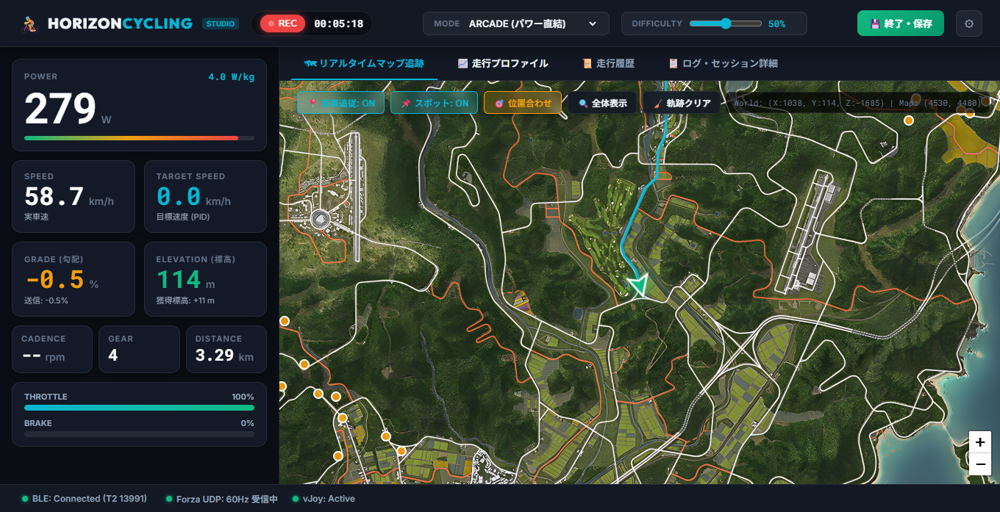
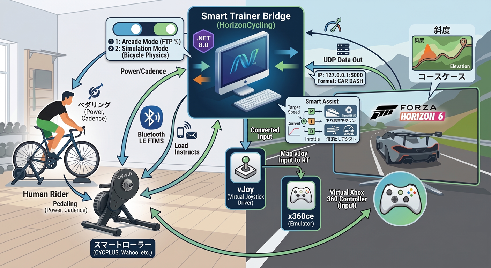
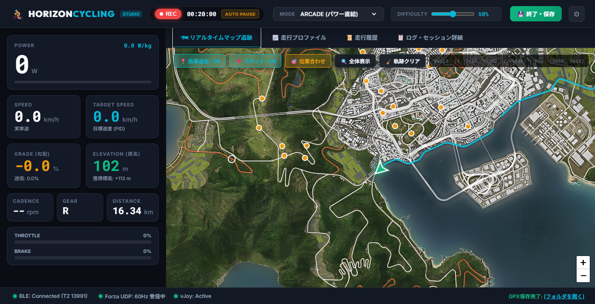
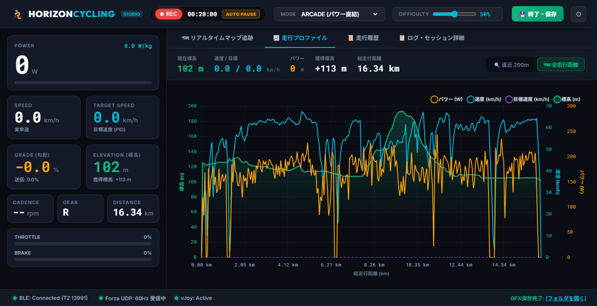
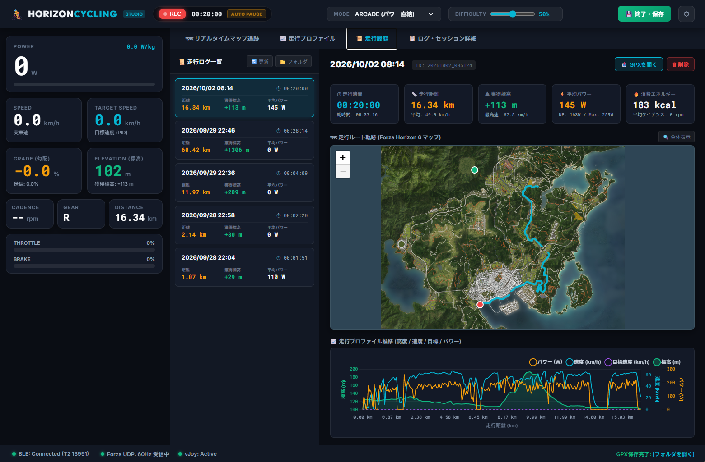
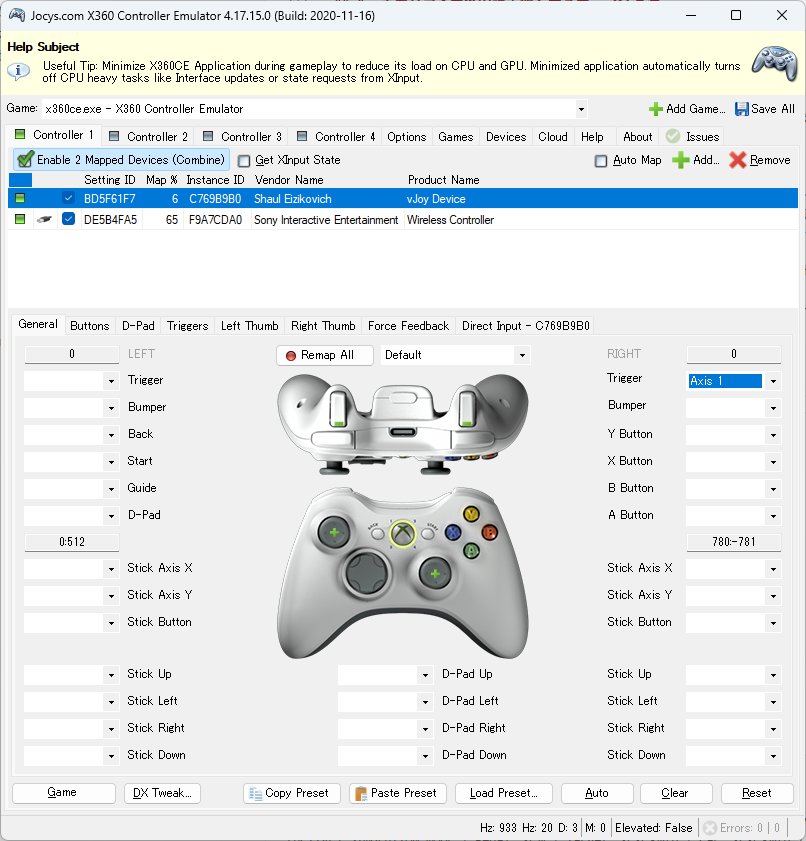
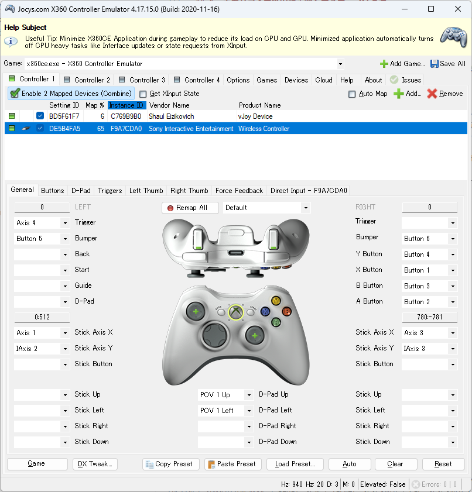

# HorizonCycling Studio (Smart Trainer & Forza Dual-Bridge)


スマートローラートレーナーとレースゲーム（Forza Horizon 6）を双方向で接続し、現実のペダリングによるゲーム内の車の運転と、ゲーム内の地形変化（斜度）に応じたローラー負荷の自動再現を両立する、Windows 用バーチャルサイクリング・ダッシュボードアプリケーションです。

<div align="center">
  
  
</div>

実走感にこだわった物理シミュレーションと、ゲームの自動操舵アシストを活かすためのインテリジェントなアシスト機能を搭載しており、没入感の高いバーチャルサイクリング体験を提供します。

WPF + Microsoft WebView2 ハイブリッドアーキテクチャを採用したモダンGUIアプリケーション **「HorizonCycling Studio」** をメインとし、大型HUDメーター、高精細マップでのリアルタイム自車追跡、リアルタイム標高・走行プロファイルグラフ、走行ログ自動記録および走行履歴ビューアを提供します。

> [!NOTE]
> **💡 コンソール版（HorizonCyclingBridge）について**  
> 最小限のシステムリソースで軽量に動作させたい場合や、コマンドライン環境で利用したい方向けに、従来の画面固定型コンソールアプリケーション **「HorizonCyclingBridge (CUI版)」** もサブアプリケーションとして引き続き同梱・利用可能です。

<div align="center">
  
</div>

---

## ⚠️ 【最重要】免責事項 (Disclaimer)

* **本アプリは、Microsoft Corporation、Xbox Game Studios、Playground Games、および各種スマートローラーメーカー（CYCPLUS、Wahoo、Tacx、Zwift等）とは一切関係のない、個人が開発した「非公式のファンメイドツール（Not affiliated with Microsoft / Playground Games）」です。**
* 本アプリの使用によって生じたハードウェアの破損、ゲームアカウントのBAN（利用停止）や制限、PC環境の不具合、事故、ケガ、その他のいかなる損害についても、開発者は一切の責任を負いません。すべて**自己責任**でご利用ください。

---

## 🚀 主な機能と特徴

### 1. メインアプリ: HorizonCycling Studio (GUI版) のリッチな機能

#### ① アスレチックHUDメーター & 直感的な操作パネル
* **リアルタイムメトリクスHUD**: 大型パワー表示（W / W/kg / ゾーンバー）、速度（実車速 / PID目標車速）、勾配（% / 送信%）、標高（m）および獲得標高（+m）、ケイデンス（rpm）、ギア、走行距離（km）、スロットル・ブレーキ開度バーを常時見やすくレイアウト。
* **ワンクリック調整**: 走行中でもヘッダーから「動作モード（Simulation / Arcade）」の切り替え、「スマートローラー負荷難易度（Difficulty: 0〜100%）」のスライダー調整、「ペダルブレーキON/OFF」を直感的に操作可能。

#### ② リアルタイムマップ追跡（Live Map Tracker）
<div align="center">
  
</div>

* **高精細タイルマップ連動**: 8192×8192 の高解像度マップ上を、自車の位置（ワールド座標マッピング）および進行方向（方位角Yaw）に合わせて自車矢印アイコンがスムーズにリアルタイム追従します。
* **鮮やかな走行軌跡ライン**: 走行したルートにネオンシアン色の軌跡ライン（Polyline）を描画。
* **名所・イベントスポット（POI）表示**: マップ上に富士山周辺やフェスティバル会場などの名所ピンを表示。
* **自車追従ON/OFF & ワンクリック位置合わせ**: 地図のスクロール・拡大縮小に加え、自車の自動追従切り替え、地図と自車位置のワンクリックキャリブレーション（位置合わせ）機能を搭載。

#### ③ リアルタイム標高・走行プロファイル（Elevation & Power Profile）
<div align="center">
  
</div>

* **マルチ軸リアルタイムチャート**: 標高（m）、車速（km/h）、目標車速（km/h）、ペダルパワー（W）の推移を色分けされたグラフでリアルタイムプロット。
* **デュアルビュー切り替え**:
  * 🔍 **直近 200m モード**: 現在地直前からの高低差とパワーを拡大表示し、目前の勾配変化に合わせたペース配分が可能。
  * 🗺 **全走行距離モード**: スタートからの全行程の標高プロファイルと走行ログを俯瞰。
* **ノイズ除去と正確な獲得標高積算**: サスペンション振動による微小な標高ノイズをEMA（指数移動平均）フィルタで平滑化し、ヒステリシス付きロジックで正確な獲得標高（Elevation Gain: +〇〇m）をリアルタイム計算。

#### ④ 走行データ自動記録＆履歴参照（Auto-Record & History Viewer）
<div align="center">
  
</div>

* **スマート自動記録（Auto-Start / Auto-Pause）**: アプリ起動・走行開始で手動操作不要の自動計測スタンバイ。停車中（< 1.0 km/h）やゲームのポーズ/メニュー操作中を検知して自動一時停止（オートポーズ）するため、実走時間と平均速度・平均パワーが正確に記録されます。
* **Strava / Garmin 互換 GPX 1.1 エクスポート**: 走行終了時に「💾 終了・保存」を押すと、標準GPX 1.1ファイルを `logs/activities/` に自動出力。画面上の「[フォルダを開く]」からワンクリックでStravaやGarmin Connectへアップロードできます。
* **アプリ内走行履歴ビューア**: 「📜 走行履歴」タブから過去のアクティビティ一覧、詳細サマリー（走行時間、総時間、走行距離、獲得標高、最高速、平均/NPパワー、消費エネルギー等）、全体マップ上の走行ルート軌跡、プロファイル推移グラフをいつでも確認できます。

---

### 2. 中核となる物理シミュレーションとスマートアシスト

#### ２つの動作モード
* **アーケードモード (Arcade Mode)**  
  ペダリングパワー（W）を基準パワー（FTP: Functional Threshold Power）で割り、車のアクセル開度（0〜100%）にダイレクトに反映させるシンプルな直感的操作モードです。レースゲームならではの疾走感を感じられます。

* **シミュレーションモード (Simulation Mode)**  
  ライダーと自転車の物理モデル（総重量、重力、空気抵抗、転がり抵抗、チェーン効率）に基づいて「本来自転車であれば出るはずの目標速度」を毎フレームリアルタイムに計算し、車の速度がその速度に追従するように **PID制御** でアクセルを細かく自動コントロールします。

  > [!NOTE]
  > **💡 PID制御とは？**  
  > 本アプリが算出する「自転車の目標速度」に、ゲーム内の「車の速度」をぴったり一致させるための自動スロットル（アクセル）調整システムです。
  > * **P (比例: Proportional)**: 現在の速度差が大きいほど、アクセルを強く踏み込みます（基本的な加速）。
  > * **I (積分: Integral)**: 上り坂などで目標速度に届かない状態が続くと、徐々にアクセルを強く踏み増します（失速・タレの防止）。
  > * **D (微分: Derivative)**: 目標速度に急激に近づいたとき、アクセルを適度に緩めて行き過ぎやギクシャク感を抑えます（滑らかな走行の維持）。
  > 
  > この3つの要素を毎秒高頻度で計算・調整することで、滑らかで自然なペダリング追従を実現しています。

#### 没入感を高めるスマートアシスト
* **下り坂での自動滑走アシスト（オートパイロット）**: 実車同様に、下り坂に入ると足を止めても重力によって車がスルスルと自動加速します。また、Forzaの「アクセルON時のみ機能する自動操舵アシスト」が切れてコースアウトするのを防ぎます。
* **仮想ギアダウン機能（車の限界によるペダル負荷軽減）**: 登り坂で車のパワー不足により減速した際、ペダルが異様に重くなって漕ぎ続けられなくなる現象を防ぐため、車速低下に合わせて「自動で軽いギアに変速する」ようにスマートローラーへ送信する斜度を自動で下げるアシストを行います。
* **平地・下り坂での完全スピンフリー（無負荷）化**: 送信斜度が0%以下の局面では物理抵抗レベル自体を強制的に「0 (完全フリー)」に切り替え、下り坂で足を高速回転させた際のスカスカと軽い滑走感を実現しています。
* **サスペンション姿勢沈み込み・加減速ノイズの相殺**: 加速・減速時の姿勢ノイズや空気抵抗によるフロント浮き（約 -0.9% 程度の定常オフセット）を数学的に相殺し、平地ではペダルが完全にフラット（0%）になるよう補正します。
* **漕ぎ出し発進アシスト＆激坂デッドロック防止**: 坂道の途中で停車または極低速（3.0 km/h以下）になった際、スマートローラーの重い斜度負荷を強制的に `0%` に解放し、軽い漕ぎ出しでのスムーズな発進をアシストします。
* **3ゾーンペダルブレーキ制御**: ペダル入力(W)のみで「加速」「コースティング」「ブレーキ」を直感的に制御。平地や登りで脚を止めるとアクティブブレーキが作動（ON/OFF切り替え可能）。

---

## 🛠 必要環境と前提ツール

本アプリを使用するには、以下のハードウェアおよびソフトウェア環境が必要です。

### 1. ハードウェア要件
* **Windows OS PC**: Windows 10 (バージョン 19041 以降) または Windows 11 (64-bit)。Bluetooth LE 機能を搭載していること。
* **入力ソースデバイス（以下のいずれか）**:
  * **FTMS対応スマートローラートレーナー**: BLE（Bluetooth Low Energy）の標準FTMSプロトコルに準拠したスマートローラー。ゲームの地形に合わせた自動負荷調整（フィードバック）がフル機能します。
    * *動作確認済み機材*: **CYCPLUS T2**
  * **BLEパワーメーター**: Cycling Power Profile（UUID: 0x1818）に準拠したパワーメーター。非連動の固定ローラーと組み合わせてペダリング入力をゲームに反映できます（※自動負荷調整は行われませんが、物理シミュレーションはフル活用されます）。
  * *注意*: Bluetooth LE接続のみ対応しています。ANT+通信には対応していません。
* **対応ゲーム**: Forza Horizon 6

### 2. 必要ソフトウェア・ツール
本アプリがペダリングパワーをゲーム内車の入力へ変換し、ゲーム内斜度をローラーへ反映するために、以下のツールを事前にセットアップする必要があります。

* **.NET 8.0 Runtime**: アプリケーションの実行に必要です。
* **Microsoft Edge WebView2 Runtime**: GUI版（HorizonCycling Studio）の画面描画に必要です（※Windows 11には標準搭載されています。Windows 10で未インストールの場合はMicrosoft公式ページより導入してください）。
* **vJoy (Virtual Joystick) [推奨フォーク版]**: 仮想ジョイスティックドライバー。
  * ※重要：公式サイト（sourceforge）の古いオリジナル版（v2.1.8等）は最新のWindows 10/11の署名要件に対応しておらず、インストール中にPCのフリーズや再起動ループを引き起こすトラブルが多発します。必ず下記の**有志による修正フォーク版**を導入してください。
  * [jshafer817氏によるvJoyフォーク版 (v2.1.9.1)](https://github.com/jshafer817/vJoy/releases) または [njz3氏によるvJoyフォーク版](https://github.com/njz3/vJoy/releases) を強く推奨します。
* **x360ce (Xbox 360 Controller Emulator)**: vJoy入力をXbox 360コントローラー入力に変換するエミュレーター。
  * ※ForzaシリーズなどのゲームはvJoyのようなDirectInputデバイスを直接認識しづらいため、x360ceを介して「Xbox 360 コントローラー」として偽装してゲームに認識させます。
  * Glitchtest51氏による[x360ceフォーク版](https://github.com/Glitchtest51/x360ce/releases/tag/v4.17.15.1) からダウンロードします。

---

## ⚙️ セットアップ手順（ステップ・バイ・ステップ）

### ステップ 1: vJoy のインストールと設定
1. 推奨されるフォーク版 [jshafer817/vJoy Releases](https://github.com/jshafer817/vJoy/releases) から最新の `.exe` インストーラーをダウンロードします。
2. ダウンロードしたファイルを右クリックし、必ず **「管理者として実行」** を選択してインストールします。
3. インストール完了後、スタートメニューから **「Configure vJoy」** アプリを開き、**Device 1** を以下のように設定して「Apply」を押します。
   * **Axes**: `X` にチェックを入れます（ゲーム内アサインの検出率向上のため、`RX` にもチェックを入れておくことを推奨します）。
   * **POV Hat**: `None`
   * **Number of Buttons**: `8` 以上
4. **【インストールがフリーズした場合の対処法】**
   * `Ctrl` + `Shift` + `Esc` でタスクマネージャーを開き、「vJoy Setup」タスクを強制終了します。
   * デバイスマネージャーを開き、「ヒューマン インターフェイス デバイス」内に黄色い警告（！）のついた「vJoy Device」等があれば右クリックから削除します。
   * `C:\Program Files\vJoy` フォルダを削除し、PCを一度再起動した後に、管理者権限でフォーク版インストーラーを再実行してください。

### ステップ 2: vJoyInterface.dll のコピーと配置（超重要）
本アプリがvJoyドライバーと直接通信するために、64bit版の `vJoyInterface.dll` がアプリの実行フォルダ内に同梱されている必要があります。
1. vJoyのインストールが成功すると、通常は以下のフォルダにDLLが生成されます。
   * インストール先パス: `C:\Program Files\vJoy\x64\`（64bit Windows環境の場合）
2. 上記フォルダ内にある **`vJoyInterface.dll`** （64bit版）をコピーします。
3. コピーしたファイルを、本アプリの実行フォルダ（`HorizonCyclingApp.exe` や `HorizonCyclingBridge.exe` があるフォルダの直下）に貼り付けます。
   * ※もしDLLが見つからない場合は、vJoyのGitHub等から `vJoyInterface.dll` (64bit版) を個別にダウンロードして配置してください。

### ステップ 3: x360ce のインストールと設定
1. Glitchtest51氏による[x360ceフォーク版](https://github.com/Glitchtest51/x360ce/releases/tag/v4.17.15.1) の `x360ce.exe` をダウンロードし、任意のフォルダに保存して起動します。
2. 起動時に仮想コントローラー用ドライバー **「ViGEmBus」** のインストールを促された場合は、必ず画面の指示に従ってインストールしてください。
3. アプリケーション画面の **「Controller 1」** タブを開き、**「Add」** ボタンをクリックします。
4. デバイス一覧から **「vJoy Device」** を選択して追加します。
5. x360ceのコントローラーマッピング画面にて：
   * **「Right Trigger (RT)」** (アクセル) に vJoy の `Axis X` (または `Axis 1`) を割り当てます。
   * **「Left Trigger (LT)」** (ブレーキ) に vJoy の `Axis Y` (または `Axis 2`) を割り当てます。
6. 設定後、ペダルを回す（またはテストキーを押す）と、x360ceの「RT」および「LT」インジケーターが 0%〜100% で反応することを確認します。
7. **注意**: ゲームプレイ中および本アプリ使用中は、x360ceを常にバックグラウンドで起動したままにしてください。

- **vJoy Deviceの設定例**  
  
- **USB接続しているコントローラーの設定例**  
  

### ステップ 4: ゲーム側のテレメトリ設定 (Forza Horizon 6 の例)
1. ゲームを起動し、**「設定」 ➔ 「画面表示とゲームプレイ (HUDとゲームプレイ)」** を開きます。
2. 最下部にあるテレメトリ送信設定を以下のように設定します。
   * **データ出力 (Data Out)**: `オン (ON)`
   * **データ出力IPアドレス (Data Out IP Address)**: `127.0.0.1` (ローカルPC自身)
   * **データ出力ポート (Data Out Port)**: `5000` (本アプリの受信ポート)
   * **データ出力パケット形式**: `ダッシュ`（Car Dash 324バイト）
3. ゲーム内の「コントロール」設定を開き、x360ce経由でエミュレートされた仮想の「Xbox 360 Controller」がアクセル・ブレーキ入力として正常に動作・アサインされていることを確認します。

#### 💡 バーチャルサイクリング（フィットネス）向け推奨ゲーム内設定
ゲーム内で完全にペダリング（フィットネス走行）に集中し、スマートローラーでZwiftのように快適に走るための**おすすめ設定**です。テレメトリ設定のついでに、ゲーム内の **「設定」 ➔ 「難易度」** および **「オーディオ」** から以下の設定を行うことを強く推奨します。

##### ① 難易度・アシスト設定（ペダリングへの完全集中）
ハンドル操作を自動化し、コントローラーを一切触らずにペダリングだけで自動走行・自動コーナリングを行うための設定です。

| 設定項目 | 推奨値 | 設定する目的・効果 |
| :--- | :---: | :--- |
| **ステアリング** | `オートステアリング` | **【最重要】** ハンドル操作が自動化され、ペダリングに完全集中できます。 |
| **ブレーキング** | `アシストあり` | コーナー進入時に自動で適切に減速し、コースアウトを防ぎます。 |
| **シフトチェンジ** | `AT` | 変速操作を自動化し、ペダルの重さの変化に集中できます。 |
| **トラクションコントロール** | `オン` | タイヤの空転を防ぎ、ペダリングパワーを安定して速度に変換します。 |
| **スタビリティコントロール (STM)** | `オン` | 車体の挙動の乱れやスピンを防ぎ、安定した直進性を確保します。 |
| **ローンチコントロール** | `オン` | 停車状態からの漕ぎ出し・発進時のスリップを防ぎます。 |
| **ダメージ/タイヤ摩耗** | `外観のみ` | 衝突などによる車両の性能低下を防ぎ、安定して漕ぎ続けられます。 |
| **ドライビングライン** | `オフ` | 視界をクリアにして風景に集中できます。 |

##### ② オーディオ設定（エンジン騒音ノイズのカット）
現実世界でスマートローラーを漕いでいる際、ゲーム内の大排気量エンジン音やタイヤのスキール音が爆音で鳴り響くのを消し、現実のサイクリング環境に近い静かな没入感を得るためのおすすめ設定です。

| 設定項目 | 推奨値 | 設定する目的・効果 |
| :--- | :---: | :--- |
| **プレイヤーカー** | `0` | **【おすすめ】** 自車のエンジン音を消去し、静かなサイクリングを楽しめます。 |
| **タイヤ** | `0` | **【おすすめ】** コーナーでのタイヤ摩擦音（キュルキュル音）を消去します。 |
| **プレイヤー以外のマシン** | `100` | 他の車（対戦相手）が近づいたときの音は残し、臨場感を維持します。 |
| **効果音 / 音楽** | `100` | ゲーム内BGMや環境効果音をクリアに聞き取り、ドライブの雰囲気を高めます。 |

##### ③ 推奨される使用車両（非力な車）
本アプリの「シミュレーションモード」は、ペダリングパワーから自転車本来の運動方程式に基づいて目標速度（時速30km〜60km程度）を算出し、車の速度がそれにぴったり追従するように自動アクセルを制御します。そのため、最高速度が時速300kmを超えるようなスーパーカーを使用すると、車の過剰なトルク特性によってPID制御がギクシャクしやすくなります。**最も滑らかで自然な実走感を得るためには、ゲーム内で「低馬力で軽量な非力な車」を使用することを強く推奨します。**

* **特におすすめの車種**:
  * **P50 (1962 Peel P50)**: 超軽量・極低馬力のマイクロカー。自転車の速度域やマイルドな加速フィールに最も相性が良く、安定した素晴らしい連動体験が得られます。アーケードモードで他のP50と競いあう場合は、アップグレードショップで吸気系やミッションをカスタムすると快適です。
  * **VIVIO RX-R (Subaru Vivio RX-R)**: 日本の軽量な軽自動車。ペダリングのトルク感に近く、自然な加減速や登坂負荷を体験するのに非常に適しています。

##### ④ おすすめの遊び方とルート選定方法（プレイングガイド）
1. **基本の遊び方（目的地への自動案内走行）**
   * ゲーム内で **ワールドマップ** を開き、走りたい目的地（行き先）をクリックしてルートを設定します。
   * マップを閉じてゲーム画面に戻り、スマートローラーをペダリングするだけで、オートステアリング機能が働き、車は設定したゴールに向かって道路に沿って自動的に滑らかに走り出します。
   * **【💡 手元での自由なドライブも可能】**: 手元でゲームコントローラー（パッド）を操作できるのであれば、オートステアリングに頼らず、手元のコントローラーで自由にステアリングを切ることで、交差点を気ままに曲がったり、美しい景色のあるお好みのオフロードに入ったりと、完全に自由なバーチャルサイクリングを楽しめます！
2. **お好みのルートを自由に走りたい場合（クリエイティブハブの活用）**
   * 景色の良いお気に入りの道路や、トレーニングに適したアップダウンのある特定のルートを走りたい場合は、ゲーム内の **「クリエイティブハブ」** 機能を利用してカスタムルート（ブループリント）を作成・保存し、そのイベントを開始してからペダリングすることで、自分専用のバーチャルサイクリングコースをいつでも走ることができます。

---

## 💻 アプリケーションの起動と使い方

配布パッケージ（Release zip）を解凍し、直下に `vJoyInterface.dll` が配置されていることを確認します。

### 1. メイン: HorizonCycling Studio (GUI版) の使い方

1. スマートローラーの電源を入れます（他アプリと未接続のペアリング待機状態にします）。
2. **`HorizonCyclingApp.exe`** をダブルクリックして起動します。
3. 起動すると、洗練されたアスレチックダークテーマのGUIダッシュボードが表示されます。
   * 下部フッターに `Forza UDP: 60Hz 受信中`、`vJoy: Active` などのステータスが表示されます。
4. **【スマートローラー / パワーメーターの接続】**:
   * 初回起動時または接続先を変更したい場合は、画面右上の **「⚙ 設定」** アイコンをクリックします。
   * 「BLEセンサー設定」ダイアログで **「デバイスを検索」** をクリックし、検出されたお使いのスマートローラー（例: `T2 13991`, `Kickr Core` 等）を選択して接続します。
   * ご自身の「基準FTP（W）」を入力して保存します（次回以降は自動接続・自動復元されます）。
5. **走行の開始**:
   * Forzaゲーム内で走行を開始すると、ペダリングパワー、車速、勾配、マップ上の自車位置がリアルタイムに連動します。
   * 走行を開始すると自動でタイマーがスタート（Auto-Start）し、停車時は自動一時停止（Auto-Pause）します。
6. **タブの切り替え**:
   * **🗺 リアルタイムマップ追跡**: 自車位置の追従、周辺の名所スポットピン、走行軌跡を確認。
   * **📈 走行プロファイル**: リアルタイムな標高・パワー・車速グラフ、「直近200m / 全走行距離」の表示切り替え。
   * **📜 走行履歴**: 過去の走行ログ一覧、詳細サマリー、地図上のルート軌跡、プロファイルの振り返り。
   * **📋 ログ・セッション詳細**: システムイベントログやテレメトリ詳細情報の確認。
7. **セッションの保存と終了**:
   * 走行を終えたら、右上の **「💾 終了・保存」** をクリックします。
   * `logs/activities/` に Strava / Garmin Connect 互換の GPX ファイルが自動保存され、右下に完了トーストが表示されます。「[フォルダを開く]」をクリックすれば保存先フォルダが即座に開きます。

---

### 2. サブ: HorizonCyclingBridge (コンソール/CUI版) の使い方

システムリソースを極力節約したい場合や、ミニマルな画面で運用したい場合は、従来のコンソール版をご利用いただけます。

1. **`HorizonCyclingBridge.exe`** をダブルクリックして起動します。
2. **初回起動時の初期設定 (CLI)**:
   * 周囲のBLEデバイス（FTMSおよびパワーメーター）のスキャンが10秒間行われます。
   * 見つかったデバイスの番号を入力してパワーソースを選択します。
   * 続いて「基準FTP（W）」の入力プロンプトが表示されます（未入力・Enterで200W）。
   * 動作モード（`1`: Arcade / `2`: Simulation）および負荷難易度（0〜100%）を選択します。
   * 設定は `config.json` に保存され、次回以降は自動ロードされます（※再設定したい場合は `--setup-sensors` 引数を付けて起動してください）。
3. **固定型ダッシュボード画面**:
   接続に成功すると、画面が位置固定型のダッシュボード表示に切り替わり準備完了です。

   ```text
   ===============================================================================
     HorizonCyclingBridge - Smart Trainer & Forza 6 Dual-Bridge
   ===============================================================================
    [SYSTEM STATUS]
     Mode             : SIMULATION MODE
     BLE Device       : Connected (FTMS: E547C9BAB968)
     vJoy Controller  : ACTIVE (Device 1)
     Telemetry Status : ACTIVE (Port 5000)
     Pedal Brake      : OFF (Coast/Free when stop pedaling)
   -------------------------------------------------------------------------------
    [REALTIME METRICS]
     Pedal Power      :   215 W           | Speed (Target/Car) : 32.5 / 31.8 km/h
     Road Grade (Raw) :   +4.2 %          | Road Grade (Sent)  : +2.1 %
     Difficulty       :    50 %           | Out (Thr / Brk)    :  85% /   0%
   -------------------------------------------------------------------------------
    [CONTROLLER INSTRUCTIONS]
     [-] / [+] : Change Difficulty (±10%)   |  [M] : Switch Mode (Sim/Arcade)
     [T]       : Test Throttle (3 seconds)  |  [B] : Toggle Pedal Brake ON/OFF
     [Space]   : Emergency Brake test (3s)  |  [Q] : Quit Application
   -------------------------------------------------------------------------------
    [RECENT LOGS]
     [12:04:15] Selected Mode: SIMULATION MODE
     [12:04:15] Trainer Difficulty set to: 50%
     [12:04:15] Pedal Brake: OFF
     [12:04:16] [vJoy] Successfully acquired and reset vJoy device 1.
     [12:04:17] [BLE] Smart trainer resistance set to FREE (Level 0).
     [12:04:18] [BLE] Connection to 'T2 13991' completely established. Ride Ready!
   ===============================================================================
   ```

#### ⌨️ コンソール版の実行中キーボード操作
コンソールウィンドウがアクティブなとき、以下のキーでリアルタイム操作が可能です。

| キー操作 | 機能 | 動作の詳細 |
| :---: | :--- | :--- |
| **`-` キー** | 負荷難易度を 10% 下げる | スマートローラーの負荷再現割合（Difficulty）を 10% 減少（最小 0%）。`config.json` に即座に保存されます。 |
| **`+` キー** | 負荷難易度を 10% 上げる | 負荷再現割合を 10% 増加（最大 100%）。`config.json` に即座に保存されます。 |
| **`M` キー** | 動作モードの動的切り替え | 「シミュレーションモード」と「アーケードモード」を交互に瞬時に切り替えます。 |
| **`B` キー** | ペダルブレーキのON/OFF切り替え | ペダルを止めたときに自動ブレーキをかける動作を ON/OFF 切り替えます。 |
| **`T` キー** | アクセル動作テスト（3秒） | vJoyを介して、アクセル開度 100% を3秒間強制送信します（テスト用）。 |
| **`Space` キー** | 緊急ブレーキテスト（3秒） | vJoyを介して、ブレーキ開度 100% を3秒間強制送信します（テスト用）。 |
| **`Q` キー** | アプリケーションの安全な終了 | 通信やGATTセッションを安全にクリーンアップして終了します。 |

---

## 📜 変更履歴 (Changelog)

### v1.1.0 (走行データ自動記録 & 走行履歴ビューア)
* **走行データの完全自動記録 (Auto-Start / Auto-Pause)**:
  アプリ起動・走行開始時の自動記録開始、停車中（< 1.0 km/h）やゲームメニュー時の自動一時停止・再開に対応。
* **「📜 走行履歴」タブの新設**:
  過去の走行ログ一覧、詳細サマリー（走行時間、実走行時間、獲得標高、平均/NPパワー、消費エネルギー等）、全体マップ上の走行ルート軌跡、プロファイルグラフをアプリ内で閲覧・確認可能に。
* **ワンタッチ・セッションローテーション**:
  「軌跡クリア」押下時に現在のセッションを安全に自動保存し、即座に新規セッション記録を開始。

### v1.0.0 (HorizonCycling Studio - GUI Edition 正式リリース)
* **WPF + WebView2 ハイブリッドGUIの全面採用**:
  アスレチックダークテーマのモダンなデスクトップGUIダッシュボードを新設。
* **リアルタイムマップ追跡（Live Map Tracker）の実装**:
  Leaflet.jsによる8192×8192 高精細日本マップ連動、自車マーカーの進行方向追従、走行軌跡ライン描画、名所ピン表示。
* **リアルタイム標高・走行プロファイルチャートの実装**:
  Chart.jsによるマルチ軸リアルタイムグラフ、「直近200m / 全走行距離」デュアルビュー、EMAフィルタによるノイズ低減と獲得標高積算。
* **Strava / Garmin 互換 GPX 1.1 エクスポート機能**:
  セッション終了時の標準GPXファイル自動生成機能。
* **GUI設定パネル**:
  BLEデバイスの探索・ワンクリック接続、FTP設定、マップ縮尺・原点キャリブレーション機能。

### v0.6
* **ペダルブレーキ動作のON/OFF切り替え機能の追加**:
  ペダルを止めたときに自動ブレーキをかける動作の切り替えと設定の永続化。

### v0.5
* **基準FTP（Functional Threshold Power）の設定および次回自動保持**:
  初回セットアップでのFTP入力プロンプトと `config.json` への自動保存。

### v0.4
* **ペダルパワー運動制御ブレーキ機能 (3ゾーンペダルコントロール) の実装**:
  ペダル入力(W)のみで「加速」「コースティング」「ブレーキ」を直感的に制御。

### v0.3
* **コンソール出力の位置固定化（ダッシュボード化）**:
  画面スクロールによるログ流れを防止した画面固定型ダッシュボードUIの実装。
* **動作モード・負荷難易度の次回デフォルト値保持**:
  前回選択設定の `config.json` 保存と自動復元。

---

## 🔧 ドキュメント・詳細仕様書

より詳細なアーキテクチャや技術仕様については、`docs` フォルダ内の各種ドキュメントを参照してください。

* **GUIプログラム構造仕様書**: [docs/20260924-GUIプログラム構造仕様書.md](docs/20260924-GUIプログラム構造仕様書.md)
* **走行データ自動記録・履歴参照機能 仕様書**: [docs/20260928-走行データの記録.md](docs/20260928-走行データの記録.md)
* **GUI化計画書**: [docs/20260923-GUI化計画書.md](docs/20260923-GUI化計画書.md)
* **GUI化完了報告書**: [docs/20260923-GUI化完了報告書.md](docs/20260923-GUI化完了報告書.md)
* **テレメトリデータの活用検討**: [docs/20260923-テレメトリデータの活用.md](docs/20260923-テレメトリデータの活用.md)
* **基本物理・通信仕様書**: [docs/20260530-HorizonCycling仕様書.md](docs/20260530-HorizonCycling仕様書.md)

---

## 📄 ライセンス (License)

本プロジェクトは **MIT ライセンス** の下で公開されています。詳細については、プロジェクトに含まれる [LICENSE](LICENSE) ファイルを参照してください。
