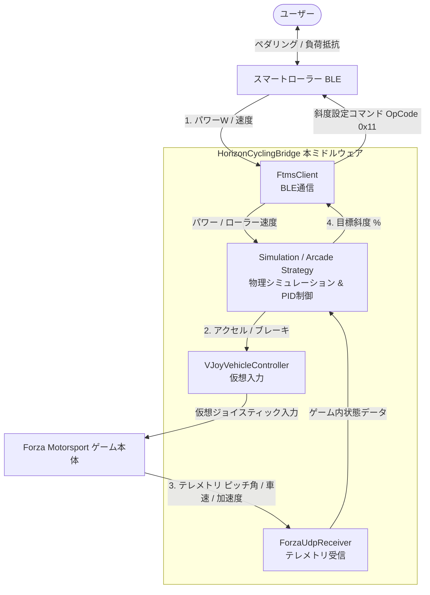

# HorizonCyclingBridge システム仕様書

本仕様書は、スマートローラートレーナーとレースゲーム（Forza Motorsport等）を双方向に連動させるミドルウェアブリッジ **「HorizonCyclingBridge」** のシステム構成、動作仕組み、および制御ロジックについて解説したドキュメントです。
本システムは、現実世界のペダリングパワーとゲーム内の車両速度を同期し、同時にゲーム内の地形変化（斜度）をスマートローラーの負荷として忠実にフィードバックすることで、極めて没入感の高いバーチャルサイクリング体験を提供します。

---

## 1. システム概要と双方向連携のコンセプト

本システムは、以下の2つの主要なフィードバックループ（双方向連携）から成り立っています。



### ① 入力ループ（ペダルパワー ➔ ゲーム内アクセル）
1. スマートローラーから **ペダリングパワー（W）** および **ローラーの物理速度（km/h）** をBluetooth LE経由でリアルタイムに取得します。
2. 取得したパワーに基づき、**自転車物理モデル**を用いて「本来自転車であれば出るはずの目標速度（Target Speed）」をリアルタイムに計算します。
3. 計算された目標速度と、ゲーム内から受信した**現在の車の速度（Car Speed）**を比較し、**PID制御**によって目標速度に追従するための最適な「アクセル（Throttle）量」および「ブレーキ（Brake）量」を算出します。
4. 算出した入力値を仮想ジョイスティック（vJoy）を介してゲームに送信し、ゲーム内の車を走らせます。

### ② フィードバックループ（ゲーム内斜度 ➔ スマートローラー負荷抵抗）
1. ゲームから送信されるUDPテレメトリパケットから、**車体のピッチ角（Pitch）、加速度（Acceleration Z）、車速（Speed）**をリアルタイムに受信します。
2. 車体の姿勢変化からサスペンションの沈み込みなどのノイズを除去し、**「純粋な道路勾配（True Road Grade %）」**を算出します。
3. ユーザーが設定した**負荷再現割合（Trainer Difficulty）**を道路勾配に乗算し、スマートローラーへ送信する目標斜度を計算します。
4. 目標斜度をBluetooth LE (GATT) FTMSプロトコルを用いてスマートローラーに送信し、スマートローラーのペダル抵抗を自動変化させます（上り坂ではペダルが重くなり、下り坂や平地では軽くなります）。

---

## 2. フォルダ構成とコンポーネントの役割

ソースコードは以下の通り各コンポーネントに分かれており、役割が明確にカプセル化されています。

| ファイルパス | クラス / インターフェース | 主要な役割 |
| :--- | :--- | :--- |
| [`Program.cs`](file:///d:/develop/HorizonCycling/src/HorizonCyclingBridge/Program.cs) | `Program` | メインエントリーポイント。各クラスの初期化、メインループの制御、キーボード入力処理、BLE送信の間引き・フィルタリング、スマートローラー難易度設定。 |
| [`Core/IPowerMappingStrategy.cs`](file:///d:/develop/HorizonCycling/src/HorizonCyclingBridge/Core/IPowerMappingStrategy.cs) | `IPowerMappingStrategy` | パワーとテレメトリからアクセル・ブレーキ出力を計算するための共通インターフェース。 |
| [`Core/ArcadeMappingStrategy.cs`](file:///d:/develop/HorizonCycling/src/HorizonCyclingBridge/Core/ArcadeMappingStrategy.cs) | `ArcadeMappingStrategy` | アーケードモード用戦略。ペダルパワーをFTP（基準パワー）で割り、アクセル開度（0〜100%）にダイレクトにマッピングするシンプルなロジック。 |
| [`Core/SimulationMappingStrategy.cs`](file:///d:/develop/HorizonCycling/src/HorizonCyclingBridge/Core/SimulationMappingStrategy.cs) | `SimulationMappingStrategy` | シミュレーションモード用戦略。自転車物理モデル、目標速度算出（ニュートン法による3次方程式求解）、ゼロパワー時挙動、下り坂重力加速エミュレーション。 |
| [`Core/SpeedPidController.cs`](file:///d:/develop/HorizonCycling/src/HorizonCyclingBridge/Core/SpeedPidController.cs) | `SpeedPidController` | 車速を目標速度に追従させるためのPID制御エンジン。アンチワインドアップ（積分飽和制限）を内蔵。 |
| [`Core/ControlOutput.cs`](file:///d:/develop/HorizonCycling/src/HorizonCyclingBridge/Core/ControlOutput.cs) | `ControlOutput` | 計算されたアクセル（Throttle: 0.0〜1.0）とブレーキ（Brake: 0.0〜1.0）を保持するデータ構造体。 |
| [`Trainer/FtmsClient.cs`](file:///d:/develop/HorizonCycling/src/HorizonCyclingBridge/Trainer/FtmsClient.cs) | `FtmsClient` | Windows BLE API を使用した、スマートローラートレーナーとのGATT通信クライアント。データ（パワー・ケイデンス・速度）受信と、負荷（斜度・抵抗レベル）指令送信。 |
| [`Telemetry/ForzaDataPacket.cs`](file:///d:/develop/HorizonCycling/src/HorizonCyclingBridge/Telemetry/ForzaDataPacket.cs) | `ForzaDataPacket` | Forza Motorsport から送られるUDPテレメトリパケット（リトルエンディアン仕様）を解析・構造体化するパースクラス。 |
| [`Telemetry/ForzaUdpReceiver.cs`](file:///d:/develop/HorizonCycling/src/HorizonCyclingBridge/Telemetry/ForzaUdpReceiver.cs) | `ForzaUdpReceiver` | 指定ポート（デフォルト：5000）で非同期UDP待ち受けを行い、受信したデータをパケットクラスに流す受信サーバー。 |
| [`Controller/VJoyVehicleController.cs`](file:///d:/develop/HorizonCycling/src/HorizonCyclingBridge/Controller/VJoyVehicleController.cs) | `VJoyVehicleController` | C++製 `vJoyInterface.dll` を P/Invoke (DLL Import) で呼び出し、仮想的なジョイスティック軸信号としてゲームにキー追従出力を送るデバイスコントローラー。 |

---

## 3. 核心的な制御ロジックと動作の仕組み

### 3.1 物理モデルに基づく目標速度計算 (ニュートン・ラフソン法)
シミュレーションモードの心臓部となるのが、**「ペダリングパワーから出力を得るための自転車物理方程式」**です。

#### 物理方程式の定義
一般的なロードバイクとサイクリストが平地または坂道を走行する際の必要パワー $P$ は、以下の運動方程式（物理シミュレーション）で表されます。

$$P \cdot \eta = v \cdot \left( M \cdot g \cdot C_{rr} \cdot \cos(\theta) + M \cdot g \cdot \sin(\theta) \right) + A_{aero} \cdot v^3$$

*   $v$ : 自転車の速度 (m/s) ➔ **【これを算出したい】**
*   $P$ : ユーザーの瞬時ペダリングパワー (W)
*   $\eta$ : ドライブトレイン（チェーンやギア）効率。定数 `0.97` (エネルギー伝達率97%)
*   $M$ : 総重量（ライダー + 自転車）。定数 `75.0` kg
*   $g$ : 重力加速度。定数 `9.81` m/s²
*   $C_{rr}$ : タイヤの転がり抵抗係数。定数 `0.004` (ロードタイヤ相当)
*   $\theta$ : 道路勾配角 (ラジアン)
*   $A_{aero}$ : 空気抵抗項の係数 $\left(A_{aero} = \frac{1}{2} \rho C_d A\right)$
    *   $\rho$ : 空気密度。定数 `1.225` kg/m³
    *   $C_d A$ : 空気抵抗係数 × 前面投影面積。定数 `0.32` m²
    *   結果として、 $A_{aero} \approx 0.196$ となります。

#### 方程式の解法
上記方程式を整理すると、速度 $v$ に関する3次方程式が得られます。

$$A_{aero} \cdot v^3 + B \cdot v + C = 0$$

ここで、係数 $B$ および定数項 $C$ は以下の通りです。

$$B = M \cdot g \cdot (C_{rr} \cdot \cos(\theta) + \sin(\theta))$$
$$C = -P \cdot \eta$$

この方程式を、プログラム内部で高精度かつ高速に解くため、**ニュートン・ラフソン法（数値解析）**を適用しています。毎フレーム最大15回反復計算を行い、誤差が $10^{-4}$ 以下に収束した時点の $v$ を目標速度（`TargetSpeedMps`）とします。

#### 下り坂におけるデッドロック回避設計
下り坂（斜度が負）の場合、傾斜による重力加速成分が転がり抵抗を上回ると、係数 $B$ が負になります ($B < 0$)。
この状態で単に初期値を $v = 0$ 付近から探索スタートさせると、数値計算の特性上、負の速度領域に計算が引きずり込まれ、最終的に `0.5 m/s` (約1.8 km/h) という不自然に遅い速度でループがロックしてしまう重大なバグが発生します。

これを完全に防ぐため、`SimulationMappingStrategy.cs` では以下の**インテリジェント初期値選定**を採用しています。
*   $B \ge 0$ (平地・上り坂) の場合：前フレームの目標速度（または初期値 5.0 m/s）からスタート
*   $B < 0$ (下り坂) の場合：重力と空気抵抗が釣り合う「重力による自由滑走速度（終端速度）」を逆算し、それを初期値とします。

$$v_{init} = \max\left(5.0,\, \sqrt{\frac{-B}{A_{aero}}}\right)$$

これにより、常に実数解のすぐ手前から探索が開始されるため、いかなる急な下り坂であっても計算がデッドロックすることなく、正確に高速な目標速度が弾き出されます。

---

### 3.2 ノイズを排除するテレメトリ姿勢補正

Forzaのテレメトリから送られてくるピッチ角（`Pitch`）には、純粋な道路勾配だけでなく、**「加減速による車体の前後の沈み込み（ピッチング姿勢変化）」**や**「空気抵抗によるサスペンションの定常的な姿勢変化」**が含まれており、これをそのままスマートローラーに送ると、平地を走っているにもかかわらず「常に上り坂を踏まされているような重さ」を感じてしまいます。

本システムでは、`Program.cs` の L130-148 にて、以下の高度な姿勢補正を行っています。

#### ① 座標系の変換
Forzaの内部ピッチ角は右手系であるため、車首が上がると（上り坂）負の値を指します。これを自転車側で扱いやすいように符号反転させ、かつ正接（`Tan`）を取ることで勾配パーセンテージに変換します。

$$\text{RawGradePercent} = -\tan(\text{Pitch}) \times 100$$

#### ② サスペンション姿勢沈み込みと空力沈み込みの相殺補正
車速が一定以上（`Speed > 3.0 km/h`）の走行時は、以下の式で純粋な勾配 $G_{true}$ を求めます。

$$G_{true} = \text{RawGradePercent} - (\text{AccelerationZ} \times 0.12) - 0.9$$

*   **定常オフセット補正 (`-0.9%`)**
    空気抵抗や駆動駆動トルクによって車首がわずかに浮く（リアサスペンションが沈む）定常姿勢ノイズ（約 -0.9% 分）を常時引き算して平地を完全にフラット（0%）に補正します。
*   **動的加減速補正 (`- AccelerationZ * 0.12`)**
    加速時にフロントが浮き（`AccelerationZ > 0` ➔ ピッチ角が上りを指す）、減速時にフロントが沈む（`AccelerationZ < 0` ➔ ピッチ角が下りを指す）慣性ノイズを、Z軸加速度に比例する係数 `0.12` を掛けて相殺します。

これにより、車が急加速・急ブレーキを行っても、スマートローラー側のペダルが急に重くなったり軽くなったりする不快な挙動が完全に消え去り、滑らかなペダリングが可能になります。

---

### 3.3 ペダルを止めた際の制御ロジック (惰性走行 & 下り坂自動加速)

サイクリングにおいて「ペダルを回し続けること」と「足を止めて惰性で走ること（コースティング）」はどちらも重要です。本システムでは、ペダルパワーが0Wになったとき（足を止めたとき）の挙動を、道路の斜度（`TrueRoadGradePercent`）に応じて完全に自動で切り替えます。

```mermaid
flowchart TD
    Power{ペダルパワーは0Wか？}
    Power -->|No (ペダリング中)| Normal[通常PID制御<br/>最低アクセル20%保証<br/>ブレーキ強制0%]
    Power -->|Yes (足を止めた)| Grade{真の道路勾配<br/>TrueRoadGradePercent < -3.0% か？}
    
    Grade -->|No (平地・上り坂)| Coast[平地/上り 惰性走行<br/>・アクセル強制0%<br/>・PIDリセット<br/>・自然に速度低下]
    Grade -->|Yes (下り坂)| Descent[下り坂 重力自動滑走<br/>・ブレーキ強制0%<br/>・自動アクセル送信<br/>・傾斜比例加速]
```

#### ① 平地・上り坂でのゼロパワー惰性走行
ペダルパワーが `15W` 以下であり、かつスマートローラーの回転速度が `3.0 km/h` 以下の場合、または道路勾配が平地・上り（$\ge -3.0\%$）である場合：
*   自転車本来の「足を止めれば自然に進まなくなる」感覚を表現するため、**アクセルを強制的に `0%`** にします。
*   同時に、PID制御器の内部積分値をリセット（`_pidController.Reset()`）し、次にペダルを回し始めたときに急加速（ワインドアップ現象）が起きないように安全対策を施します。
*   ブレーキは踏まないため、ゲーム内の車はエンジンブレーキと空気抵抗によって滑らかに減速（コースティング）します。

#### ② 下り坂での重力自動滑走（オートパイロット・重力エミュレーション）
実車の自転車では、下り坂に入るとペダルを回さなくても自重（重力）によって自動で加速します。また、レースゲーム側の「アクセルON時のみ自動操舵を行う」というオートアシスト仕様を維持し、下り坂で足を止めても車がコースアウトするのを防ぐため、以下の自動アクセル機構を備えています。

道路勾配が明確な下り坂（`TrueRoadGradePercent < -3.0%`）であり、かつゲーム内の車が動いている場合：
*   ブレーキを強制的に `0%` に固定します。
*   最低保証値としてのベースアクセル `20%` に対し、**難易度に影響されない「素の道路勾配（絶対値）」**に比例した出力を自動で上乗せします。

$$\text{Throttle}_{descent} = \min\left(0.20 + |\text{TrueRoadGradePercent}| \times 0.05,\, 0.80\right)$$

*   **下り坂の傾斜1%につき 5%（0.05）のアクセルが自動追加**され、最大で `80%` までアクセルを自動で踏み込みます。
*   これにより、「ペダルを止めても下り坂の傾斜に合わせて車が自然に時速30km以上へスルスルと加速していく」という、自転車本来の下り坂の爽快感をゲーム内で完璧に再現しています。

---

### 3.4 スマートローラーの負荷制限・スマートアシスト

スマートローラーへ斜度負荷をBLE送信する際、スマートローラーの性能限界や、接続している車の限界性能によってペダリングが不快にならないよう、複数のスマートアシスト機能が組み込まれています。

#### ① 負荷再現割合 (Trainer Difficulty) の適用
設定された `_trainerDifficulty`（0.0〜1.0）を道路勾配に乗算します。
*   **上り坂**： `DifficultyGrade = TrueRoadGrade * Difficulty`
*   **下り坂**： 下り坂は負荷が抜けすぎてペダルの手応えが完全にスカスカになるのを防ぎ、適度な抵抗感を残すためにさらに半分（50%減少）にマイルド化して送信します。
    
    $$\text{DifficultyGrade}_{downhill} = \text{TrueRoadGrade} \times \left(\text{Difficulty} \times 0.5\right)$$

#### ② 仮想ギアダウン（車の限界スピードによる負荷軽減アシスト）
例えば、Vivio RX-Rなどの非力な軽自動車（あるいは極端にパワーの低い車）を運転している際、上り坂でいくらユーザーがペダルを必死に漕いで「目標速度30km/h」を出そうとしても、車の馬力が足りずにゲーム内の車速が「15km/h」程度で頭打ちになってしまうことがあります。
このとき、スマートローラー側は「激しい上り坂の重い負荷」を要求し続けるため、**「一生懸命漕いでいるのに車がまったく進まず、ただペダルが劇重で苦しいだけ」**という理不尽なデッドロック状態に陥ります。

これを解消するため、システムは「目標速度（Target）」に対して「実際の車速（Car）」が追いついていない（アクセル全開なのに引き離されている）度合いを検出し、**スマートローラーに送る斜度負荷を自動で引き下げる（ペダルを軽くする＝仮想的なギアダウン）アシスト**を行います。

*   発動条件：目標速度 $> 10.0\text{ km/h}$ かつ 現在車速 $<$ 目標速度 $\times 95\%$ かつ 送信斜度 $> 0\%$ (上り坂)
*   計算式：

$$\text{Deficit (不足率)} = 1.0 - \left(\frac{\text{CarSpeed}}{\text{TargetSpeed}}\right)$$
$$\text{GearMultiplier} = \max\left(0.0,\, 1.0 - (\text{Deficit} \times 4.0)\right)$$
$$\text{SentGrade} = \text{TargetIncline} \times \text{GearMultiplier}$$

不足率（Deficit）が数%発生しただけでも、乗数（$\times 4.0$）によって強力にペダルが軽くなります。これにより、車の馬力不足に合わせて「ペダルが自動的に軽いギア（ローギア）に変速される」ような体験となり、実車同様に「軽いギヤでクルクルとケイデンスを回して坂を登る」ことが可能になります。

#### ③ 絶対上限リミッター
スマートローラーが要求する極端な激坂負荷によってユーザーの膝や腰を痛めるのを防ぐため、送信する最大斜度に対して難易度に比例した絶対リミッターをかけます。

$$\text{MaxIncline} = 15.0 \times \text{Difficulty}$$

例えば難易度が10%（`0.1`）に設定されている場合、元の坂がどれだけ急な20%の激坂であっても、スマートローラーへ送られる負荷斜度は最大で `1.5%` に制限されます。

#### ④ 下り坂・平地での物理抵抗レベル 0 (完全フリー) 解放
スマートローラー（特にFTMSプロトコル準拠のローラー）の多くは、「斜度0%」を指定していても、内部の物理シミュレーションによって「速度に依存した空気抵抗（高速回転するほど重くなる）」を自動で発生させてしまいます。
これにより、下り坂で足を回して高速回転させた際に、ペダルが異様に重くなって回せなくなる現象が発生します。

本システムでは、**平地および下り坂（送信斜度が 0% 以下）の時、斜度指示の送信を完全に停止し、代わりにスマートローラーの物理抵抗レベル自体を強制的に「0（完全スピンフリー）」に変更**します（OpCode `0x04` を使用）。
これにより、下り坂や平地でいくらクランクを高速回転させても、ローラーによる内部空気抵抗が完全にシャットアウトされ、スカスカと気持ちよく回る「完璧な解放感」を実現しています。

---

### 3.5 BLE送信の間引き・デバウンス制御

Bluetooth LEは通信帯域が狭く、毎フレーム（秒間60回）スマートローラーにコマンドを送ると、パケット詰まりを起こしてスマートローラーの応答がフリーズしたり、制御に極端な遅延（ラグ）が発生したりします。
そのため、`Program.cs` の L193-278 にて、以下の厳格な送信制限を設けています。

1.  **時間デバウンス**：前回の送信から最低でも **1.5秒（1500ms）** 経過していること。
2.  **不感帯（デッドバンド）**：前回の送信斜度から最低でも **0.8%** 以上の変化があること。
3.  **スルーレート制限（最大変化率）**：1回の送信での斜度の急激な変化を **±2.0%** に制限し、スマートローラーの抵抗が急変して足や膝に衝撃が走るのを防ぎます（自然な斜度変化に平滑化）。
4.  **強制ゼロリセット**：
    斜度が平地に近づき、フィルターされた斜度が `±0.3%` 未満になった場合は、上記 1. 2. の制限を無視して、**即座に斜度 0.0%（または抵抗レベル0のフリー状態）を送信して完全に平地にリセット**します（平地に戻ったのにローラーがいつまでも重い状態を引きずるのを防ぐため）。

---

## 4. 主要パラメータの設定値とチューニング方法

ユーザー自身が好みの乗り味に調整できるように、主要なチューニングパラメータの場所と調整推奨値をまとめました。

### 4.1 PIDゲインの調整 (車の追従性)
`Program.cs` の L53 にて、PIDゲインを設定できます。

```csharp
strategy = new SimulationMappingStrategy(kp: 1.0f, ki: 0.2f, kd: 0.05f);
```

*   **`Kp` (比例ゲイン - 初期値: `1.0f`)**：
    *   **役割**：目標速度と車速の「現在の差」に対する反応の強さ。
    *   **チューニング**：値を大きくするとアクセルの立ち上がりが鋭くなり、ペダルを回し始めてから車が加速するまでのレスポンスが上がりますが、大きすぎると車速がハンチング（ギクシャクと前後に揺れる）したり、アクセルが100%と0%を激しく行き来するようになります。車の馬力が小さい場合（軽自動車等）は大きめ、大排気量スポーツカーの場合は小さめ（`0.5f`近辺）が適しています。
*   **`Ki` (積分ゲイン - 初期値: `0.2f`)**：
    *   **役割**：目標速度に届かない状態が「続いている時間」に対する反応の強さ。坂道などでの速度のタレ（オフセット誤差）を解消します。
    *   **チューニング**：上り坂で目標速度に車速がなかなか追いつかない場合に大きくします。ただし、大きすぎると目標速度をオーバーシュートした後にアクセルが戻らなくなったり（ワインドアップ）、ペダルを止めた後もしばらく加速し続けたりする危険があります。
*   **`Kd` (微分ゲイン - 初期値: `0.05f`)**：
    *   **役割**：車速の「変化の勢い」に対するブレーキ的な反応の強さ。急激な速度変化を予測して出力を抑え、ハンチングを抑制します。
    *   **チューニング**：加速や減速がギクシャクする場合に少しずつ（`0.01`刻みで）増やします。

---

### 4.2 下り坂自動加速の微調整
`SimulationMappingStrategy.cs` の L116-124 にて調整可能です。

```csharp
if (TrueRoadGradePercent < -3.0 && currentCarSpeedMps > 1.0f)
{
    output.Brake = 0.0f;
    double baseThrottle = 0.20;
    double additionalThrottle = Math.Abs(TrueRoadGradePercent) * 0.05;
    output.Throttle = (float)Math.Min(baseThrottle + additionalThrottle, 0.80);
}
```

*   **自動加速開始の閾値 (`-3.0`)**：
    *   サスペンション補正後であっても、路面のうねりやサスペンション特性によって平地で `-1%`〜`-2%` 程度に一時的に振れることがあります。これによる「平地なのにペダルを止めても勝手に車が走り出すバグ」を防ぐため、安全マージンとして `-3.0%` に設定されています。車高調やサスペンションが非常に硬い車（レースカー等）に乗る場合は、`-2.0%` や `-1.5%` に引き下げることで、より緩やかな下り坂から自動重力加速を開始させることができます。
*   **傾斜比例係数 (`0.05`)**：
    *   下り坂1%あたりに追加されるアクセル量。`0.05` は 5% を意味します。
    *   下り坂でのスピードの乗りが悪い（自転車にしては遅すぎる）と感じる場合は、この値を `0.07` や `0.08` に増やすことで、急坂での自動加速パワーを強化できます。
*   **最大自動アクセルリミット (`0.80`)**：
    *   自動アクセルの最大上限値（80%）。下り坂で勝手にエンジンがフルパワー（100%）で回り続けて爆走するのを防ぐ安全リミッターです。

---

### 4.3 スロットル平滑化フィルター (人間らしい入力の再現)
`SimulationMappingStrategy.cs` の L38 にて定義されています。

```csharp
private const double THROTTLE_ALPHA = 0.08;
```

*   **役割**：PIDが毎フレーム弾き出す「機械的なアクセル量」を、ペダリングのトルク変動（1回転の中での踏み込み・引き足のムラ）に近い「滑らかな人間の操作」へと変換するフィルターです。
*   **チューニング**：`0.08` は約0.3秒かけて入力を追従させます。値を小さくする（例: `0.04`）と、ペダルを雑に回したり、一瞬足を止めたりしてもアクセル開度が一切ブレず、非常にスムーズで滑らかな走行になりますが、加減速のレスポンスはマイルド（もっさり）になります。値を大きくする（例: `0.15`）と、ダイレクト感が増しますが、ペダリングのムラが車速の小刻みな揺れとして現れやすくなります。

---

## 5. 操作方法・キーボードコントロール

プログラムのコンソール画面がアクティブ（選択状態）の時、以下のキーボード操作を受け付けます。

| キー操作 | 機能 | 動作の詳細 |
| :--- | :--- | :--- |
| **`[` - `]` キー** | 負荷再現割合（Difficulty）の調整 | `-` キーで難易度を 10% 下げ、`+` キーで 10% 上げます（0% 〜 100% の範囲）。難易度を変更すると、スマートローラーへ即座に補正された新しい斜度が再送信されます。難易度が `0%` に達した場合は、即座に抵抗レベル `0`（完全スピンフリー）に固定されます。 |
| **`M` キー** | 動作モードの動的切り替え | 「シミュレーションモード」と「アーケードモード」を交互に切り替えます。切り替え時、現在のペダリング状態やスマートローラーの負荷抵抗が即座に最新モードで更新されます。 |
| **`T` キー** | アクセル動作テスト（3秒間） | vJoyを介して、アクセル開度 100% を3秒間強制送信します。Forza側でコントローラーの設定やアサインが正常に行われているか、ペダルを漕がずにテストする際に使用します。 |
| **`B` キー** | ブレーキ動作テスト（3秒間） | vJoyを介して、ブレーキ開度 100% を3秒間強制送信します。ブレーキ入力のアサインテスト用です。 |
| **`Q` キー** | アプリケーションの安全な終了 | 実行中のUDP受信サーバーを停止し、スマートローラーとのBLE接続を安全に切断（GATTセッションの解放）して、コンソールを閉じます。**※Escキー等による不意の強制終了を防止し、BLEセッションのクリーンアップ漏れを防ぐ設計となっています。** |

---
*仕様書作成基準日: 2026年5月30日*
