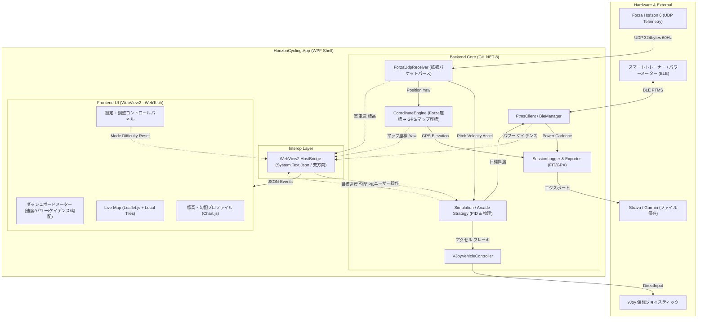

# HorizonCycling GUI アプリケーション刷新計画書

作成日: 2026-09-23  
対象バージョン: HorizonCycling v1.0.0 (GUI Edition)  
関連ドキュメント: [20260923-テレメトリデータの活用.md](file:///d:/develop/HorizonCycling/docs/20260923-%E3%83%86%E3%83%AC%E3%83%A1%E3%83%88%E3%83%AA%E3%83%87%E3%83%BC%E3%82%BF%E3%81%AE%E6%B4%BB%E7%94%A8.md) / [20260530-HorizonCycling仕様書.md](file:///d:/develop/HorizonCycling/docs/20260530-HorizonCycling%E4%BB%95%E6%A7%98%E6%9B%B8.md)

---

## 1. 計画の背景と目的

### 1.1 背景
現状の「HorizonCyclingBridge」はコンソールUI（CUI）として実装されており、安定した双方向通信（BLEスマートトレーナー ⇔ Forza Horizon 6 UDP ⇔ vJoy）と物理シミュレーションを提供してきました。
しかし、サイクリング中の視認性（遠くのディスプレイからの見やすさ）、マウスやタッチによる直感的なパラメータ調整（Trainer Difficulty、FTP設定等）、そして新しく判明したテレメトリの位置情報・標高データを活用した「本格的なバーチャルサイクリング体験」を実現するには、CUIでは表現力に限界があります。

### 1.2 目的
本計画では、HorizonCyclingをモダンな **GUIデスクトップアプリケーション** として全面刷新します。
従来のCUIで表示・操作していた全機能をモダンなビジュアルへ移行するとともに、「テレメトリデータの活用」で挙げられた以下の3つの新機能を中核機能として統合します。

1. **【機能①】走行ログのエクスポート（GPX / FIT形式）**: StravaやGarmin Connectと連携可能なアクティビティログ出力
2. **【機能②】リアルタイム標高プロファイル＆獲得標高トラッカー**: ヒルクライムの実感を高める標高グラフ・獲得標高表示
3. **【機能③】リアルタイムマップ追跡（Live Map Tracker）**: ゲーム内マップ（日本マップ）上を自車アイコンがリアルタイム追従するナビゲーション画面

---

## 2. システム要件・画面設計

### 2.1 画面レイアウト構成案（3ペイン / タブ統合型ダッシュボード）

大画面ディスプレイ（ゲームプレイ中のサブモニタ）やタブレット端末からの視認性を考慮し、ダークテーマを基調とした洗練されたアスレチック/サイバーパンク調のUIを採用します。

```
+----------------------------------------------------------------------------------------------------+
|  [● REC 00:24:15]  HorizonCycling Studio      [MODE: SIMULATION ▼]  [DIFFICULTY: 70% ──●──] [⚙ 設定] |
+------------------------------------+---------------------------------------------------------------+
|  【左ペイン: メインメーター】      |  【右ペイン: マップ & 標高ビュー (タブ切替)】                |
|                                    |   [ 🗺 マップ追跡 ]   [ 📈 標高プロファイル ]   [ 📋 ログ/詳細 ]     |
|   POWER                            |  +---------------------------------------------------------+  |
|    [  215  ] W                     |  |                                                         |  |
|   3.1 W/kg (FTP: 240W)             |  |        (8192x8192 タイルマップリアルタイム追従)         |  |
|  --------------------------------  |  |                                                         |  |
|   SPEED           TARGET SPEED     |  |                     ▲ 自車位置アイコン (北向き/回転)    |  |
|    [ 32.4 ] km/h   [ 31.8 ] km/h   |  |                  ／                                     |  |
|  --------------------------------  |  |               〜〜〜 (走行軌跡ライン)                   |  |
|   GRADE (勾配)    ELEVATION (標高) |  |                                                         |  |
|    [ +4.5 ] %      [  342  ] m     |  |  [POI: 富士スバルライン]                                |  |
|   (Sent: +3.15%)  獲得標高: +185 m |  +---------------------------------------------------------+  |
|  --------------------------------  |  【右下: リアルタイム勾配・標高プロファイル（直近2km）】   |
|   CADENCE         HEART RATE       |  1000m|                                                    |  |
|    [  88  ] rpm    [ 142  ] bpm    |   500m|             /\_                                    |  |
|  --------------------------------  |     0m+------------/---\------現在地●------------------+  |
|   THROTTLE: [||||||||||  ] 65%     |       -2.0km           -1.0km                0km (現在)    |
|   BRAKE   : [            ]  0%     |  ---------------------------------------------------------+  |
+------------------------------------+---------------------------------------------------------------+
|  STATUS: [BLE: Connected (Kickr Core)]  [Forza UDP: 60Hz 🟢]  [vJoy: Active 🟢]   [💾 走行終了 & 保存] |
+----------------------------------------------------------------------------------------------------+
```

### 2.2 主要機能要件

#### A. 既存CUI機能の完全移行
- **リアルタイムメトリクス表示**: パワー（W, W/kg）、車速（km/h）、目標速度（km/h）、勾配（%）、送信勾配（%）、スロットル（%）、ブレーキ（%）。
- **ステータス監視**: BLEスマートトレーナー接続状態、Forza UDPテレメトリ受信周波数（Hz/ミリ秒）、vJoy仮想デバイスステータス。
- **オンザフライ調整**:
  - モード切替（Simulation / Arcade）のワンクリックトグル。
  - Trainer Difficulty（0%〜100%）のスライダー調整。
  - ペダルブレーキ機能の有効/無効トグル。
- **コンソールログビュー**: エラーや接続イベントのタイムスタンプ付きリアルタイムログ。

#### B. 新規機能①: 走行ログのエクスポート（GPX / FIT）
- **セッションコントロール**: 「START（計測開始）」「PAUSE（一時停止）」「STOP & SAVE（終了・保存）」ボタン。
- **記録データ**:
  - タイムスタンプ（UTC / JST）
  - 位置座標（緯度・経度 / ワールド座標変換）
  - 標高（`PositionY`）
  - パワー（W）、ケイデンス（RPM）、心拍数（BPM）、車速（km/h）
- **出力フォーマット**:
  - **GPX形式**: 標準XMLフォーマット（Strava、Komoot、Relive等に直接インポート可能）。
  - **FIT形式**: Garmin/ANT+標準バイナリ形式（ファイルサイズが極小で、各種サイクリングアプリで完全互換）。
- **走行サマリー表示**: 走行距離（km）、走行時間、平均速度、平均/NPパワー、最大心拍、獲得標高（m）。

#### C. 新規機能②: 標高プロファイル＆獲得標高トラッカー
- **標高・獲得標高のリアルタイム計算**:
  - `PositionY`（メートル）の微小ノイズをローパスフィルタで平滑化。
  - ヒステリシスを設けた獲得標高（Elevation Gain: +〇〇m）の積算ロジック。
- **グラフィカル標高チャート**:
  - 直近走行した区間（例: 過去3km〜5km）の標高プロファイルを動的にプロット。
  - 勾配の急さに応じてグラフ色を変化（緑: 平坦/下り ➔ 黄: 3〜6% ➔ 赤: 7%以上 ➔ 紫: 10%超の激坂）。

#### D. 新規機能③: リアルタイムマップ追跡（Live Map Tracker）
- **大解像度タイルマップ統合**:
  - リポジトリ内 `map/.tile_cache`（Zoom 5, 8192×8192）のタイルデータを活用。
  - Leaflet.js または GPUキャンバスによるスムーズなパン、ズーム操作。
- **自車アイコン＆軌跡（ブレッドクラム）**:
  - `PositionX`, `PositionZ` をマップピクセル座標にマッピング。
  - テレメトリの `Yaw`（方位角）に合わせて自車矢印アイコンをスムーズに回転。
  - 走行したルートに鮮やかな半透明ラインを描画。
- **POI（ランドマーク）オーバーレイ**:
  - `map/fh6_japan_pins.json` から名所、フェスティバル会場、イベント地点をマップ上にピン留め表示。

---

## 3. 技術スタック選定とアーキテクチャ

### 3.1 技術スタック比較と選定

| 候補 | メリット | デメリット | 総合判定 |
| :--- | :--- | :--- | :---: |
| **A. 純粋なWPF (XAML + SkiaSharp)** | .NET ネイティブで高速。Single-file配布が容易。 | 大解像度タイルマップ（Leaflet相当）やリッチなグラフのアニメーション実装工数が非常に大きい。 | △ |
| **B. WPF + WebView2 (Blazor Hybrid / モダンWeb SPA)** ★推奨 | **既存のC# .NET 8資産（BLE/vJoy/UDP）を100%そのまま利用可能。** UI層はLeaflet.jsやChart.js等、Webエコシステムの最先端マップ・グラフ資産を活用可能。 | WebView2ランタイム（Windows 10/11には標準搭載）が必要。 | **◎ 最適** |
| **C. Electron / Tauri (Node/Rust + Web)** | クロスプラットフォーム対応が容易。 | C#のWindows.Devices.BluetoothやvJoyネイティブC++連携コードの再移植コストが極めて高い。 | ✕ |

#### 決定アーキテクチャ: 【WPF + WebView2 (ローカルHTML/JS SPA + C#双方向バインディング)】
- **言語/ランタイム**: C# / .NET 8 (`net8.0-windows10.0.19041.0`)
- **デスクトップシェル**: WPF（Windows Presentation Foundation） + Microsoft.Web.WebView2
- **フロントエンド（UI層）**:
  - HTML5 / CSS3 (TailwindCSSまたはVanilla CSSによるプレミアムダークテーマ)
  - マップエンジン: **Leaflet.js**（ローカルタイル `.tile_cache` を直接読み込み）
  - グラフエンジン: **Chart.js** または **uPlot**（60Hzリアルタイム描画でも超軽量）
  - 通信: WebView2 WebMessage（C# ⇔ JS間の超低遅延双方向IPC）
- **FIT/GPX生成ライブラリ**: `FitSdk` (Garmin公式 .NET SDK) または自作GPX XMLシリアライザ

### 3.2 システムアーキテクチャ図



---

## 4. 各新規機能の詳細設計

### 4.1 テレメトリパーサーの拡張 (`ForzaDataPacket.cs`)
既存の `ForzaDataPacket` に以下のフィールドを追加定義します。

```csharp
// 位置座標 (メートル)
public float PositionX { get; private set; } // offset 232
public float PositionY { get; private set; } // offset 236 (標高)
public float PositionZ { get; private set; } // offset 240

// 走行情報
public float Speed { get; private set; }           // offset 244 (m/s)
public float PowerWatts { get; private set; }      // offset 248 (W)
public float DistanceTraveled { get; private set; }// offset 280 (m)
public ushort LapNumber { get; private set; }      // offset 300
```

### 4.2 座標変換エンジン (`CoordinateEngine.cs`)
Forza Horizon 6 のワールド座標（`PositionX`, `PositionZ`）から、地図画像のピクセル座標およびGPX用の擬似GPS座標（緯度・経度）への変換を担当します。

1. **マップピクセル変換**:
   - `map/fh6_japan_map_cropped_4608x5632.png` または 8192×8192 のタイル座標系へ線形アフィン変換。
   - `PixelX = (PositionX - OriginX) * ScaleX`
   - `PixelY = (PositionZ - OriginZ) * ScaleZ`
2. **GPS座標変換（GPX用）**:
   - 日本（富士山周辺や東京近郊等）を基準原点（例: 富士山周辺 `Lat: 35.3606, Lon: 138.7274`）としてマッピング。
   - 1メートルあたりの緯度・経度増分を計算し、Strava上で実際の日本国内ルートを走ったかのように記録。

### 4.3 標高・獲得標高アルゴリズム (`ElevationTracker.cs`)
- **生データの課題**: テレメトリの `PositionY` はサスペンションの振動や段差でミリ秒単位で激しく微小変動します。そのまま累積すると獲得標高が過大になります。
- **対策**:
  - 移動平均フィルタ（ウィンドウ幅: 1秒 / 60サンプル）を適用。
  - 登坂判定に **しきい値（Threshold: 0.5m以上の有意な上昇のみ加算）** を設け、平坦路の微振動による誤カウントを防止。

### 4.4 走行ログ生成エンジン (`GpxFitExporter.cs`)
- **GPXフォーマット**:
  - `<trkpt lat="..." lon="...">` に `<ele>`（標高）、`<time>`、および `<extensions>`（`power`, `cadence`, `hr`）を埋め込み。
- **セッション終了フロー**:
  - ユーザーが「STOP」をクリックすると、自動的に `logs/activities/2026-09-23_14-30-00_HorizonCycling.gpx` を生成。
  - 「フォルダを開く」「Stravaへアップロード」ボタンを表示。

---

## 5. 開発ロードマップとフェーズ分け

```
[ Phase 1 ] コアライブラリ分離 & テレメトリ拡張 (1〜2週)
     │
[ Phase 2 ] GUIシェル (WPF + WebView2) 基盤 & ダッシュボード移行 (2週)
     │
[ Phase 3 ] 標高プロファイル & 獲得標高トラッカー実装 (1週)
     │
[ Phase 4 ] リアルタイムマップ (Leaflet.js + Local Tiles) 統合 (2週)
     │
[ Phase 5 ] GPX/FIT エクスポート & セッション管理実装 (1週)
     │
[ Phase 6 ] 結合テスト・実走負荷テスト・リリースパッケージ化 (1週)
```

| フェーズ | 作業内容 | 成果物 |
| :--- | :--- | :--- |
| **Phase 1: コア分離 & テレメトリ拡張** | ・既存CUIの `src/HorizonCyclingBridge` から、通信・制御ロジックをクラスライブラリ `HorizonCycling.Core` として切り離す。<br/>・`ForzaDataPacket` に `PositionX, Y, Z` パースを追加。<br/>・単体テストプロジェクトの作成。 | `HorizonCycling.Core.dll` |
| **Phase 2: GUI基盤 & ダッシュボード** | ・WPF + WebView2 プロジェクト `HorizonCycling.App` を新規作成。<br/>・モダンWebダッシュボード（スピード、パワー、ケイデンス、ステータス、Difficulty調整スライダー）の実装。<br/>・CUIの全表示項目を完全移行。 | 動作する基本GUIアプリ |
| **Phase 3: 標高＆獲得標高機能** | ・`ElevationTracker` の実装（ノイズ除去・獲得標高積算）。<br/>・Chart.js を用いた直近標高・勾配プロファイルグラフの実装。 | 標高・獲得標高表示 |
| **Phase 4: リアルタイムマップ統合** | ・Leaflet.js を WebView2 内に組み込み、`map/.tile_cache` のタイル画像をオフライン配信。<br/>・自車位置アイコンの追従、方位角（Yaw）回転、走行軌跡描画。<br/>・`fh6_japan_pins.json` のPOIピン表示。 | リアルタイムマップ画面 |
| **Phase 5: 走行ログエクスポート** | ・セッション記録（開始/一時停止/保存）機能の実装。<br/>・GPX / FIT 出力機能の実装。<br/>・Stravaインポート検証。 | 走行ログ出力機能 |
| **Phase 6: テスト & リリース** | ・長時間走行でのメモリリーク検証、60Hz描画負荷の最適化。<br/>・インストーラーまたはポータブル単一ZIPパッケージの作成。 | v1.0.0 正式リリース |

---

## 6. まとめと今後のアクション

本GUI化により、HorizonCyclingは単なる「キーボード入力・ペダル変換ミドルウェア」から、**「Forza Horizon 6の日本マップを舞台にした次世代バーチャルサイクリングプラットフォーム」** へと飛躍的に進化します。

### 次のステップ
1. **本計画書の承認・レビュー**
2. **Phase 1（コアライブラリ分離とテレメトリ拡張）の着手**
   - `src/HorizonCycling.Core` のプロジェクト分割
   - `ForzaDataPacket.cs` への `PositionX/Y/Z` 追加とテスト
