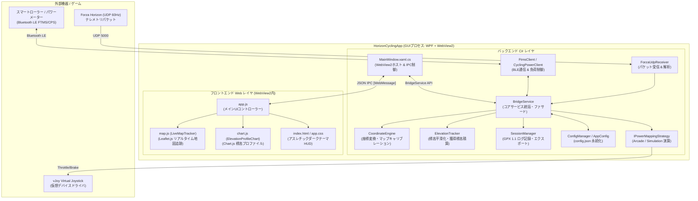

# HorizonCycling Studio (GUI版) プログラム構造仕様書

作成日: 2026-09-24  
対象バージョン: HorizonCycling Studio v1.0.0 (GUI) / HorizonCyclingBridge v0.5.0  
ドキュメント種別: 内部アーキテクチャ・プログラム構造技術仕様書  

---

## 1. 概要とシステム構成

### 1.1 システム概要
**HorizonCycling Studio** は、レーシングシミュレーター「Forza Horizon 5/6」とスマートサイクリングトレーナー（Tacx, Wahoo, Magene等）を連動させ、ゲーム内の走行・登坂・路面状況に応じたリアルな負荷フィードバックと、ZwiftやWahooスタイルの本格的なサイクリングダッシュボードを提供するWindowsデスクトップアプリケーションです。

従来のコンソール版（CUI）から、ユーザービリティ・視認性・機能拡張性を飛躍的に高めるため、**WPF + Microsoft WebView2 + モダンWebフロントエンド** を組み合わせたハイブリッドGUIアーキテクチャを採用しています。

### 1.2 全体アーキテクチャ



---

## 2. CUI（従来コンソール版）との関係性

### 2.1 コアライブラリの共有と責務分離
HorizonCycling は、プロジェクト構造として **`HorizonCyclingBridge`（コア制御ライブラリ）** と **`HorizonCyclingApp`（GUIアプリケーション）** に明確に分離されています。

| コンポーネント | プロジェクト | 役割 |
| :--- | :--- | :--- |
| **コアエンジン** | `HorizonCyclingBridge` | BLE通信（FTMS/CPS）、Forza UDP受信解析、vJoy入力制御、物理マッピング計算（Arcade/Simulation）、座標変換、標高平滑化、セッションGPX記録、設定保存 |
| **CUI版ホスト** | `HorizonCyclingBridge/Program.cs` | 開発初期のCUIエントリーポイント。コンソール画面上にテキスト形式でメーターを描画 |
| **GUI版ホスト** | `HorizonCyclingApp/MainWindow.xaml.cs` | WPF + WebView2 を用いたリッチGUIホスト。`BridgeService` をインスタンス化し、30HzのJSON IPCでWeb画面と完全双方向通信 |

### 2.2 CUIからGUIへの進化点
1. **ファサードパターンの導入 (`BridgeService`)**:
   - CUI版では `Program.cs` 内に直接記述されていた受信ループや制御処理を、スレッドセーフなファサードクラス `BridgeService` として集約・カプセル化。
   - GUI版・単体テストプロジェクト（`HorizonCycling.Tests`）の双方が共通の `BridgeService` API を呼び出せる構造を実現。
2. **状態スナップショット配信 (`BridgeStateSnapshot`)**:
   - 約30HzのUI更新レートで、パワー、実車速、目標車速、勾配、自車座標、標高、セッション経過時間などを集約したイミュータブルなスナップショットを一括通知。
3. **新規機能の拡充**:
   - **リアルタイムマップ追跡**: ゲーム内座標とLeaflet.js地図の双方向連動。
   - **標高プロファイル**: 直近200mと全走行ルートのデュアル表示切替。
   - **GPXエクスポート**: Strava/Garmin Connect互換ログ出力。
   - **GUI上でのBLEスキャン・ペアリング切替**: 設定画面からのワンクリックデバイス接続。

---

## 3. プログラム構造の詳細仕様

### 3.1 バックエンド（C#）側構造 (`src/HorizonCyclingBridge/`, `src/HorizonCyclingApp/`)

#### (1) `BridgeService.cs` (`HorizonCyclingBridge.Core`)
アプリケーション全体の中核を担うサービスクラス。
- **ゼロ座標およびメニュー画面判定（重要）**:
  Forza がメニュー、ポーズ、マップ画面を開いた際に送信してくる `PositionX == 0 && PositionY == 0 && PositionZ == 0` や `IsRaceOn == false` を検知。
  - メニュー中は直前の有効なワールド座標・ピクセル座標・標高・向き（Yaw）をキャッシュから再利用し、自車位置が原点 `(0, 0)` や `(4096, 4096)` へワープするのを完全に防止。
  - メニュー表示中は `SessionManager.AddTrackPoint` の呼び出しをスキップし、GPXログの汚染を防止。
  - `ElevationTracker` への 0m 急落送信を抑止し、累積獲得標高の狂いを防止。
- **設定の自動永続化**:
  - `SetMode(int mode)`: モード切替時に `_config.DefaultMode` を更新し即時保存。
  - `SetDifficulty(double difficulty)`: 難易度変更時に `_config.TrainerDifficulty` を即時保存。
  - `UpdateMapConfig(...)`, `CalibrateMap(...)`: マップ縮尺や原点変更時に即時保存。

#### (2) `MainWindow.xaml.cs` (`HorizonCyclingApp`)
WebView2 ホストウィンドウ。
- **仮想ホストマッピング**:
  - `https://horizoncycling.local/` → `src/HorizonCyclingApp/wwwroot` (UIアセット)
  - `https://maps.local/` → `map/` (フルマップ画像等)
  - `https://tiles.local/` → `map/.tile_cache` (Leaflet タイル画像)
- **JSON WebMessage IPC ハンドラ**:
  - `ready`: フロントエンド初期化完了時にピン一覧（`initPins`）および保存設定値（`config`: モード、難易度、FTP等）を返送。
  - `setMode`, `setDifficulty`: フロントエンドからの操作要求を `BridgeService` へ転送。
  - `scanBle`, `connectSensor`: BLEデバイス探索・接続処理の非同期ディスパッチ。
  - `calibrateMap`, `updateMapConfig`: マップ座標吸着・縮尺変更。
  - `startSession`, `pauseSession`, `resumeSession`, `stopSession`: 走行ログ制御。
  - `openLogFolder`: 保存されたGPXフォルダをエクスプローラーで選択表示。

#### (3) `CoordinateEngine.cs` (`HorizonCyclingBridge.Telemetry`)
- ワールド座標（メートル）と地図ピクセル座標（8192×8192）、GPS緯度経度（富士スピードウェイ周辺）の相互変換を担当。
- デフォルト縮尺: `0.263 px/m`（約31.1km四方）。
- `InvertZ = true`: ForzaのZ軸（北奥）と地図画像のY軸（画面下南）を整合。
- ワンクリックキャリブレーション: `Calibrate(targetPixelX, targetPixelY, worldX, worldZ)` により、走行中の道路上に自車マーカーを吸着。

#### (4) `ElevationTracker.cs` (`HorizonCyclingBridge.Telemetry`)
- 車両の `PositionY`（標高高度）から路面の微小振動ノイズを除去する EMA フィルタ。
- デッドバンド（0.25m）およびヒステリシスを設けた累積獲得標高（Elevation Gain）・累積下降（Elevation Loss）の高精度積算。

#### (5) `SessionManager.cs` (`HorizonCyclingBridge.Telemetry`)
- 走行中のトラックポイント（緯度、経度、標高、速度、パワー、ケイデンス、心拍数）をメモリに蓄積。
- セッション終了時に、Strava / Garmin Connect 標準仕様に準拠した GPX 1.1 XML ファイルを出力。

---

### 3.2 フロントエンド（HTML / CSS / JS）側構造 (`src/HorizonCyclingApp/wwwroot/`)

#### (1) `index.html`
- **2ペイン構成**:
  - **左ペイン (HUDメトリクス)**: 大型パワーメーター（W / W/kg / ゾーンバー）、速度（実車速 / 目標車速）、勾配、獲得標高、ケイデンス、ギア、距離、スロットル/ブレーキ開度バー。
  - **右ペイン (タブ切替)**:
    1. `tabMap`: Leaflet.js リアルタイムマップ追跡
    2. `tabElevation`: Chart.js 標高プロファイル
    3. `tabLogs`: リアルタイムシステムイベントログ
- **モーダルダイアログ**:
  - BLEスマートローラー検索・接続モーダル
  - サイクリングパラメータ・マップ縮尺調整モーダル

#### (2) `app.css`
- **デザインシステム**:
  - サイバーパンク・アスレチックダークテーマ（`#0a0d14`, `#121824`, `#161e2e`）
  - グラスモフィズム（`backdrop-filter: blur(8px)`）
  - ネオンカラーアクセント（ネオンシアン `#06b6d4`、ネオングリーン `#10b981`、アンバー `#f59e0b`）
  - モバイル / デスクトップに最適化されたタイポグラフィ（Google Fonts: Inter, Outfit, Roboto Mono）

#### (3) `app.js`
- C# WebView2 との WebMessage イベント送受信。
- 初期起動時に `config` ペイロードを受け取り、前回のモード選択・難易度スライダー・FTP・マップ縮尺を画面に即座に復元。
- 30Hzのスナップショットを受信してHUDメーターを滑らかに更新。

#### (4) `map.js` (`LiveMapTracker`)
- Leaflet.js `CRS.Simple` 平面直交座標系による 8192×8192 高精細地図描画。
- 自車マーカーの向き（Yawラジアンから度数法への変換）追従。
- 走行軌跡（Polyline）の自動追加。
- **メニュー時・ゼロ座標ガード**: `isPositionValid === false` または `(worldX == 0 && worldZ == 0)` のときは軌跡を描画しない。
- **ワープガード**: 250px以上の急激な長距離移動（ファストトラベルや復帰ジャンプ）が発生した際は、不自然な横断直線を引かずに新しい起点として扱う。

#### (5) `chart.js` (`ElevationProfileChart`)
- **3m距離ベースのサンプリング蓄積**:
  フレーム数依存を排除し、移動距離 3m ごとに標高データを配列 `history` へ蓄積。長距離走行時は自動で間引きを実行し、Chart.js の描画負荷を最小限に抑制。
- **デュアルビュー切り替え機能**:
  - 🔍 **直近 200m モード (`recent`)**:
    現在地から過去 200m 分の標高変化をクローズアップ表示。X軸は `-200m` 〜 `0m (現在)` の相対距離で表示され、直前の勾配変化が一目瞭然。
  - 🗺 **全走行距離モード (`all`)**:
    走行開始地点から現在地点までの全行程の標高プロファイルを表示。X軸は `0.00 km` 〜 `現在 km` の総走行距離表示。

---

## 4. 設定データ（`config.json`）の保存と復元仕様

### 4.1 保存場所とファイル形式
- **ファイルパス**: アプリケーション実行ディレクトリ直下の `config.json`
- **形式**: JSON（UTF-8, インデント整形付き）

### 4.2 設定項目一覧

```json
{
  "PowerSourceType": 1,
  "PowerSourceMacAddress": 252096489896296,
  "PowerSourceName": "T2 13991",
  "DefaultMode": 2,
  "TrainerDifficulty": 0.65,
  "Ftp": 200,
  "PedalBrakeEnabled": false,
  "MapOriginX": -612.1893222359199,
  "MapOriginZ": -223.00095057034218,
  "MapScale": 0.263,
  "InvertZ": true
}
```

| キー名 | 型 | デフォルト値 | 説明 |
| :--- | :---: | :---: | :--- |
| `PowerSourceType` | int | `0` (None) | 接続センサー種別 (0: なし, 1: FTMSトレーナー, 2: パワーメーター) |
| `PowerSourceMacAddress` | ulong | `0` | BLEデバイスのBluetooth MACアドレス（64bit整数） |
| `PowerSourceName` | string | `""` | 接続デバイスの表示名 |
| `DefaultMode` | int | `2` | 起動時デフォルトモード (1: ARCADE MODE, 2: SIMULATION MODE) |
| `TrainerDifficulty` | double | `0.5` | スマートトレーナー負荷難易度 (0.0 〜 1.0, 0%〜100%) |
| `Ftp` | double | `200.0` | ライダーの機能的作業閾値パワー (W) |
| `PedalBrakeEnabled` | bool | `false` | ペダル停止時の自動ブレーキ機能フラグ |
| `MapOriginX` | double | `0.0` | ゲーム内ワールド原点オフセットX (キャリブレーションで自動更新) |
| `MapOriginZ` | double | `0.0` | ゲーム内ワールド原点オフセットZ (キャリブレーションで自動更新) |
| `MapScale` | double | `0.263` | ワールドメートルからマップピクセルへの縮尺 (0.200〜0.300) |
| `InvertZ` | bool | `true` | ゲーム内Z軸と地図画面上下の整合フラグ |

### 4.3 保存・復元フロー
1. **保存タイミング**:
   - モード切替時（`SetMode` 呼び出し直後）
   - 難易度スライダー操作時（`SetDifficulty` 呼び出し直後）
   - BLEデバイス接続成功時（`ConnectSensorAsync`）
   - 設定モーダルで「設定を保存して閉じる」を押下した時（`updateSettings`, `updateMapConfig`）
   - 地図上で「位置合わせ」を実行した時（`CalibrateMap`）
2. **復元タイミング**:
   - アプリ起動時に `ConfigManager.Load()` によりメモリへロード。
   - `BridgeService` が初期モードおよび難易度で起動。
   - Web画面の初期化完了通知（`ready`）受信時に、`SendInitialDataToWeb` から `config` メッセージとしてフロントエンドへ送信。
   - `app.js` が UI のセレクトボックス・スライダー・入力欄へ即座に反映。

---

## 5. 走行記録（セッションログ）の保存仕様

### 5.1 保存場所とファイル名規則
- **保存ディレクトリ**: `logs/activities/`（実行ファイル基準の相対パス、存在しない場合は自動作成）
- **ファイル命名規則**: `HorizonCycling_YYYYMMDD_HHMMSS.gpx`
  - 例: `HorizonCycling_20260924_000528.gpx`

### 5.2 記録フォーマット (GPX 1.1)
Strava、Garmin Connect、TrainingPeaks 等の主要サイクリングサービスへ直接ドラッグ＆ドロップでインポートできる標準スキーマに準拠しています。

```xml
<?xml version="1.0" encoding="utf-8"?>
<gpx version="1.1" creator="HorizonCycling Studio" 
     xmlns="http://www.topografix.com/GPX/1/1"
     xmlns:gpxtpx="http://www.garmin.com/xmlschemas/TrackPointExtension/v1">
  <metadata>
    <name>HorizonCycling Activity</name>
    <time>2026-09-24T00:05:00Z</time>
  </metadata>
  <trk>
    <name>Forza Horizon Cycling Session</name>
    <type>Cycling</type>
    <trkseg>
      <trkpt lat="35.360600" lon="138.727400">
        <ele>582.4</ele>
        <time>2026-09-24T00:05:01Z</time>
        <speed>8.33</speed>
        <extensions>
          <power>215</power>
          <gpxtpx:TrackPointExtension>
            <gpxtpx:cad>88</gpxtpx:cad>
            <gpxtpx:hr>142</gpxtpx:hr>
          </gpxtpx:TrackPointExtension>
        </extensions>
      </trkpt>
      ...
    </trkseg>
  </trk>
</gpx>
```

### 5.3 記録ライフサイクル
1. **開始 (START)**:
   - ヘッダーの **[REC]** ボタンを押下。
   - `_sessionManager.Start()` が呼ばれ、`_elevationTracker.Reset()` により標高・獲得標高・走行距離の積算がリセット。
   - 画面上の標高プロファイルグラフ（`elevationChart`）も初期化。
2. **一時停止 / 再開 (PAUSE / RESUME)**:
   - 走行中の **[PAUSE]** ボタン押下でデータ蓄積を一時停止。タイマーも停止。
   - **[RESUME]** で計測再開。
3. **終了とエクスポート (STOP & EXPORT)**:
   - **[💾 終了・保存]** ボタンを押下。
   - メモリ上のトラックポイント群を XML フォーマットへ変換し、`logs/activities/` フォルダへ書き出し。
   - 保存完了トーストが画面右下にポップアップ表示され、「フォルダを開く」をクリックするとエクスプローラーで当該ファイルが選択状態で開く。

---

## 6. ビルドおよび実行方法

### 6.1 前提動作環境
- **OS**: Windows 10 (バージョン 19041 以降) または Windows 11 (64-bit)
- **.NET SDK**: .NET 8.0 SDK (x64)
- **ドライバ / ランタイム**:
  - Microsoft Edge WebView2 ランタイム（Windows 11には標準搭載）
  - vJoy Virtual Joystick Driver（vJoy デバイス #1 が有効化されていること）
  - Bluetooth 4.0/5.0 BLE アダプタ（スマートトレーナー接続用）

### 6.2 プロジェクト構成一覧
```
d:\develop\HorizonCycling\
├── HorizonCycling.sln
├── config.json
├── src/
│   ├── HorizonCyclingBridge/          # コアライブラリ (net8.0-windows10.0.19041.0, win-x64)
│   └── HorizonCyclingApp/             # GUIアプリ (net8.0-windows10.0.19041.0, win-x64)
└── tests/
    └── HorizonCycling.Tests/          # 単体テスト (xUnit)
```

### 6.3 ビルド手順

#### (1) 単体テストの実行
```powershell
# 実行中のアプリがある場合は停止
Stop-Process -Name HorizonCyclingApp -Force -ErrorAction SilentlyContinue

# テストプロジェクトの実行 (全8テスト)
dotnet test tests/HorizonCycling.Tests/HorizonCycling.Tests.csproj
```

#### (2) デバッグビルド (Debug)
```powershell
dotnet build src/HorizonCyclingApp/HorizonCyclingApp.csproj -c Debug
```

#### (3) プロダクションビルド (Release)
```powershell
dotnet build src/HorizonCyclingApp/HorizonCyclingApp.csproj -c Release
```
ビルド成果物は以下のパスに出力されます：
`src/HorizonCyclingApp/bin/Release/net8.0-windows10.0.19041.0/win-x64/HorizonCyclingApp.exe`

### 6.4 アプリケーションの実行

#### コマンドラインからの起動
```powershell
# dotnet run による直接起動
dotnet run --project src/HorizonCyclingApp/HorizonCyclingApp.csproj -c Release

# またはビルド済み EXE の直接起動
./src/HorizonCyclingApp/bin/Release/net8.0-windows10.0.19041.0/win-x64/HorizonCyclingApp.exe
```

#### ゲームとの接続確認
1. **Forza 側の設定**:
   - ゲーム内設定の「HUDとゲームプレイ」を開く。
   - 「データ出力（Data Out）」を **オン** に設定。
   - 「データ出力IPアドレス」: `127.0.0.1`
   - 「データ出力IPポート」: `5000`
   - 「データ出力パケット形式」: `ダッシュ`（Car Dash 324バイト）
2. **HorizonCycling Studio の起動**:
   - アプリを起動すると、下部フッターに「Forza UDP: 60Hz 受信中」「vJoy: Active」が表示されます。
   - スマートローラーをお持ちの場合は設定アイコン（⚙）から「デバイスを検索」を行い、該当デバイスに接続します。
   - ゲーム内で車両を走らせると、リアルタイムにメーター、地図上の自車位置、標高プロファイルが滑らかに連動します。

### 6.5 配布用パッケージング手順 (V1.0)
エンドユーザー配布用として、.NET 8 ランタイムや高精細マップ、各種設定を同梱した自己完結パッケージを作成する手順です。

```powershell
# 1. 自己完結型 (Self-Contained) 発行
dotnet publish src/HorizonCyclingApp/HorizonCyclingApp.csproj -c Release -r win-x64 -p:SelfContained=true -p:PublishSingleFile=false -o release/HorizonCycling_V1.0

# 2. 地図画像および名所ピンデータの同梱
New-Item -ItemType Directory -Force -Path 'release/HorizonCycling_V1.0/map'
Copy-Item 'map/fh6_japan_map_full_8192x8192.jpg', 'map/fh6_japan_map_cropped_4608x5632.jpg', 'map/fh6_japan_pins.json' -Destination 'release/HorizonCycling_V1.0/map/' -Force

# 3. ZIP アーカイブの作成
Compress-Archive -Path 'release/HorizonCycling_V1.0/*' -DestinationPath 'release/HorizonCycling_V1.0.zip' -Force
```
配布アーカイブは以下のパスに出力されます：
`release/HorizonCycling_V1.0.zip`
