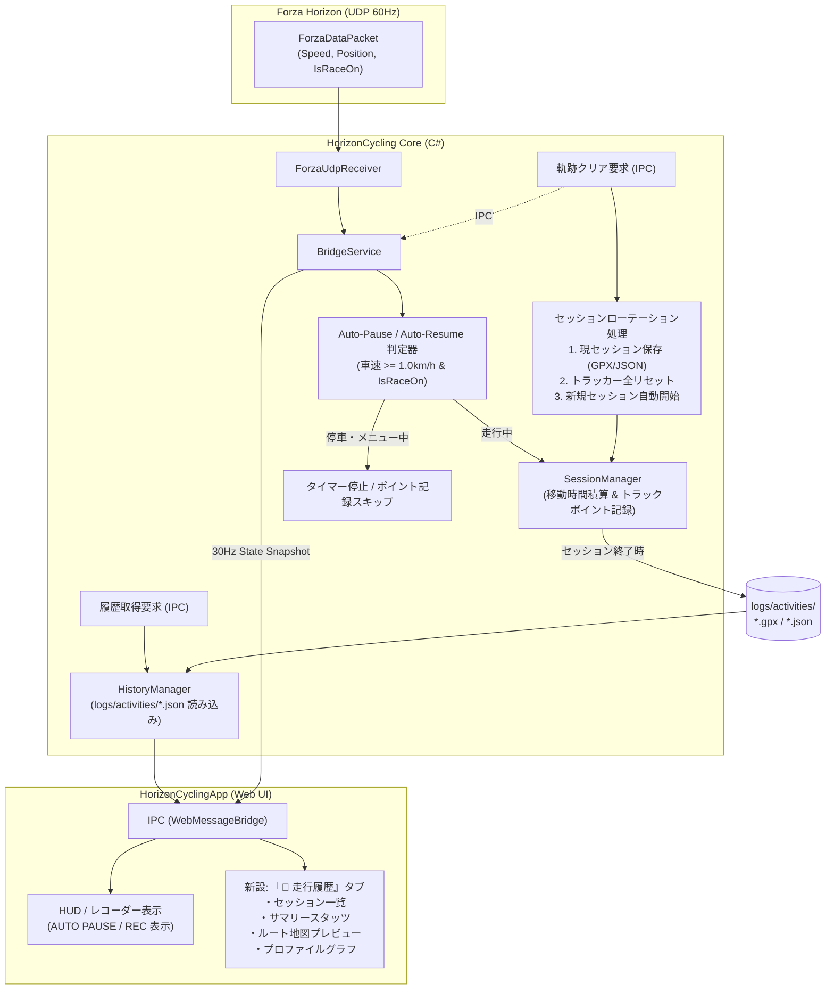
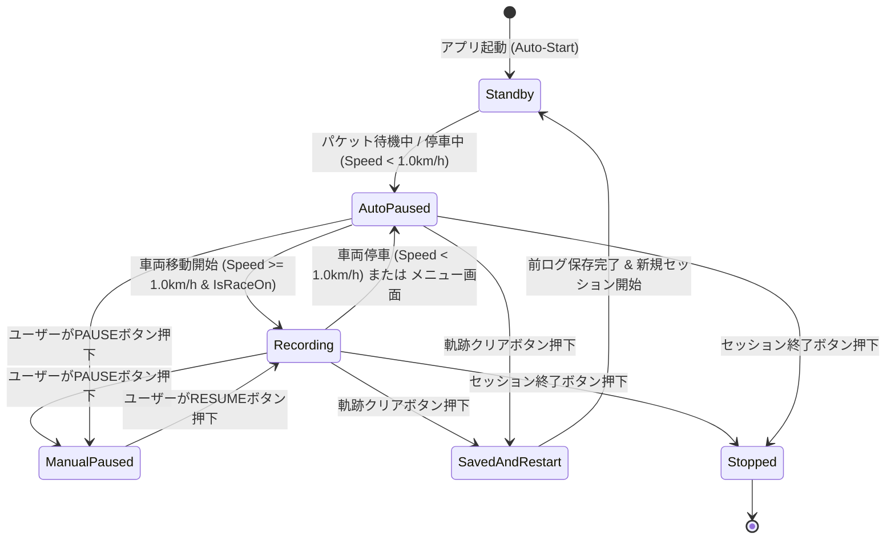
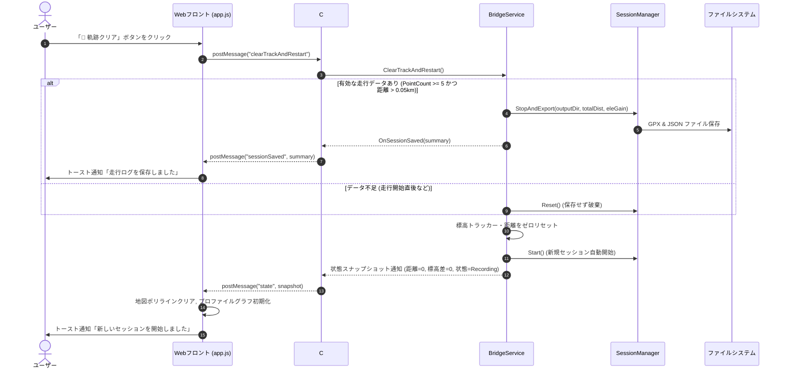
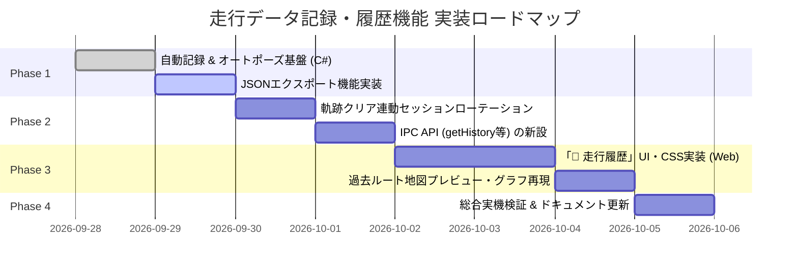

# HorizonCycling Studio 走行データ自動記録・履歴参照機能 仕様・改修計画書

作成日: 2026-09-28  
対象バージョン: HorizonCycling Studio v1.1.0  
ドキュメント種別: 機能仕様書・設計書・改修計画書  
ステータス: 計画・設計フェーズ（プログラム修正前）

---

## 1. 概要と目的

### 1.1 背景と課題
従来の HorizonCycling Studio では、走行データの記録に関して以下の課題がありました。
1. **手動録画開始の煩わしさ**: 走行開始前に画面上の「REC」ボタンを手動で押す必要があり、押し忘れによるデータ未記録が発生しやすかった。
2. **停車中・メニュー中のデータ混入**: 信号待ちや一時停止、ゲームのポーズ/メニュー操作中もタイマーが進み、同一地点の速度0データが記録され続けるため、平均速度や平均パワー、総走行時間が実際の走行実態から乖離していた。
3. **軌跡クリアと記録セッションの不整合**: 「軌跡クリア」を押しても地図やチャートの表示が消えるだけで、内部のセッションログは保存されずリセットもされなかった。
4. **過去の記録の確認不可**: セッション終了時にGPXファイルが出力されるものの、アプリケーション内から過去の走行記録を一覧表示したり、ルートやグラフを振り返るUIが存在しなかった。

### 1.2 本改修のゴール
- **完全自動記録 (Auto-Start)**: アプリ起動と同時に自動で記録スタンバイとなり、手動操作不要で記録を開始。
- **スマート一時停止 (Auto-Pause / Auto-Resume)**: 車両が実際に走行している時間のみを正確に計測・記録し、停車中やメニュー画面では自動一時停止。
- **記録メトリクスの拡充**: GPS座標・標高に加え、パワー、実車速、目標車速、ケイデンス、勾配などの詳細メトリクスを完全保存。
- **ワンタッチ・セッションローテーション**: 「軌跡クリア」を押すことで、直前のセッションを安全に保存完了した上で、即座に新しいセッションの記録を開始。
- **走行履歴ビューア (History Viewer)**: アプリケーション内に「📜 走行履歴」タブを新設し、過去の走行サマリー、地図上の軌跡、プロファイルグラフをいつでも参照・確認可能にする。

---

## 2. 要求事項と変更点サマリー

| 項目 | 従来仕様 (v1.0) | 改修後仕様 (v1.1) |
| :--- | :--- | :--- |
| **記録開始トリガー** | UI上の「REC」ボタン手動クリック | **アプリケーション起動時に自動開始**（手動操作不要） |
| **一時停止・再開** | UI上の「PAUSE」ボタン手動クリックのみ | **オートポーズ / オートレジューム**<br>（車速 < 1.0 km/h またはメニュー画面中に自動停止） |
| **記録データ項目** | 緯度, 経度, 標高, 車速, パワー, ケイデンス | 既存項目に加え、**目標車速, 勾配(%), 移動時間/総時間** を完全記録 |
| **記録保存フォーマット** | GPX 1.1 のみ | **GPX 1.1（外部連携用） + JSON（アプリ内高速参照用）** のデュアル出力 |
| **軌跡クリアの挙動** | 地図・チャート表示のリセットのみ | **現セッションを自動保存・終了し、新しいセッション記録を即時開始** |
| **過去データの参照** | なし（エクスプローラーでフォルダを開くのみ） | **「📜 走行履歴」タブ** を新設し、過去の走行一覧・地図軌跡・プロファイルグラフを表示 |

---

## 3. システムアーキテクチャと全体フロー



---

## 4. 機能別詳細仕様

### 4.1 自動記録開始 (Auto-Start)
- **動作契機**:
  - `BridgeService` の起動時（`StartAsync` 完了時）、またはアプリ起動時に自動的に `SessionManager.Start()` が呼び出されます。
  - アプリケーションが立ち上がった時点で「記録スタンバイ（走行待ち）」状態となり、ユーザーが録画ボタンを意識する必要がなくなります。
- **手動操作との共存**:
  - UIヘッダーの「REC / PAUSE」ボタンは、手動での強制一時停止やセッション確定保存を行いたい場合のオーバーライド操作として維持します。
- **アプリ終了時（×ボタン）の安全自動保存**:
  - ウィンドウの「×」ボタン押下時（`MainWindow_Closing` / `BridgeService.Dispose`）に、有効な走行データ（5点以上、または走行距離 50m以上）が存在している場合は、**自動的に `StopSession()` を呼び出して GPX / JSON ファイルへ確定保存**します。保存操作を忘れてウィンドウを閉じてもデータが消失することはありません。

### 4.2 オートポーズ / オートレジューム (Auto-Pause / Auto-Resume)
サイクリング用GPSコンピュータ（Garmin, Wahoo等）と同様の自動一時停止機能を実装します。

#### (1) 判定条件
| 状態 | 判定ロジック | 処理 |
| :--- | :--- | :--- |
| **走行中 (Moving)** | `packet.IsRaceOn == true`<br>かつ `!isZeroPosition`<br>かつ `packet.SpeedKmh >= 1.0f`<br>かつ `!isFastTravel` | ・セッションの「移動時間（MovingTime）」を積算<br>・1秒間隔でトラックポイントを記録<br>・UI状態: `Recording` |
| **一時停止 (Paused)** | `packet.SpeedKmh < 1.0f`（停車中）<br>または `!packet.IsRaceOn`（メニュー/ポーズ中）<br>または `isZeroPosition`（マップ画面等）<br>または UDPパケット未達（直近1秒以上受信なし） | ・移動時間の積算をストップ<br>・トラックポイントの追加をスキップ<br>・UI状態: `AutoPaused` |

#### (2) 状態遷移図


#### (3) 時間計測の仕様
- **総経過時間 (Total Elapsed Time)**: セッション開始から終了までの実時間（ポーズ時間を含む）。
- **走行時間 / 移動時間 (Moving Time)**: 車両が実際に時速1.0km/h以上で移動していた時間の合計。
- 平均速度・平均パワー等の集計は、**「移動時間（Moving Time）」** を母数として算出することで、停車による数値の低下を防止します。

---

### 4.3 記録データ構造とフォーマット仕様
過去の履歴参照と外部Webサービス（Strava, TrainingPeaks, Garmin Connect等）連携の双方を満たすため、**GPX 1.1** と **JSON** の2種類の形式で同一セッションを出力します。

#### (1) 保存先ディレクトリ
```text
HorizonCycling/
  logs/
    activities/
      HorizonCycling_20260928_210530.gpx   <-- Garmin拡張対応 GPX
      HorizonCycling_20260928_210530.json  <-- 高速読込用詳細JSON
```

#### (2) 記録データ項目一覧
| 項目 | 単位 | GPX出力先 | JSON出力先 | 説明 |
| :--- | :--- | :--- | :--- | :--- |
| **日時 (Timestamp)** | ISO8601 UTC | `<time>` | `timestamp` | 記録時刻 |
| **緯度・経度 (Lat/Lon)** | 度 (decimal) | `lat`, `lon` 属性 | `lat`, `lon` | ゲーム内座標から変換されたGPS座標 |
| **標高 (Elevation)** | メートル (m) | `<ele>` | `ele` | 平滑化済み標高 |
| **実車速 (Speed)** | km/h (GPXはm/s) | `<gpxtpx:speed>` | `speed` | Forza内の車両速度 |
| **目標速度 (Target Speed)** | km/h | `<extensions><targetSpeed>` | `targetSpeed` | 物理演算上の目標ペダリング速度 |
| **パワー (Power)** | ワット (W) | `<power>` | `power` | ライダーのリアルタイム出力ワット |
| **ケイデンス (Cadence)** | rpm | `<gpxtpx:cad>` | `cadence` | ペダリング回転数 |
| **心拍数 (Heart Rate)** | bpm | `<gpxtpx:hr>` | `heartRate` | BLE心拍計接続時の心拍（未接続時は0） |
| **勾配 (Grade)** | % | `<extensions><grade>` | `grade` | フィルタ済み路面勾配 |
| **積算距離 (Distance)** | km | - | `distKm` | スタート地点からの累積走行距離 |

#### (3) セッションJSONフォーマット仕様 (`.json`)
```json
{
  "sessionId": "20260928_210530",
  "startTime": "2026-09-28T12:05:30Z",
  "endTime": "2026-09-28T12:45:15Z",
  "summary": {
    "totalDurationSec": 2385.0,
    "movingDurationSec": 2100.0,
    "distanceKm": 18.45,
    "elevationGainM": 320.5,
    "elevationLossM": 185.0,
    "avgSpeedKmh": 31.6,
    "maxSpeedKmh": 58.2,
    "avgPowerWatts": 215.4,
    "maxPowerWatts": 482.0,
    "avgCadence": 86.2,
    "normalizedPowerWatts": 228.0,
    "caloriesKcal": 452,
    "workKj": 452.3,
    "mode": "Simulation",
    "ftp": 250
  },
  "points": [
    {
      "time": "2026-09-28T12:05:31Z",
      "lat": 35.360612,
      "lon": 138.727451,
      "ele": 850.2,
      "speed": 15.4,
      "targetSpeed": 16.0,
      "power": 180,
      "cadence": 78,
      "grade": 2.1,
      "distKm": 0.004
    }
  ]
}
```

---

### 4.4 軌跡クリア連動セッションローテーション (Clear & Restart)
「軌跡クリア」ボタンを押した際、現在の走行を安全に保存し、即座に次の新しい走行を開始できるようにします。

#### (1) 処理シーケンス


---

### 4.5 走行履歴ビューア (History Viewer) UI/UX 仕様

#### (1) タブバー構成の拡張
メイン画面右ペインのタブバーに **「📜 走行履歴」** を追加します。
- `[🗺 リアルタイムマップ追跡]`
- `[📈 走行プロファイル]`
- `[📜 走行履歴]` ← **新設**
- `[📋 ログ・セッション詳細]`

#### (2) 走行履歴画面の画面レイアウト案
```text
+-------------------------------------------------------------------------------+
|  📜 走行アクティビティ履歴                               [📂 フォルダを開く] [🔄 更新]  |
+------------------------------------+------------------------------------------+
|  【過去の走行一覧】                 |  【選択中セッションの詳細】                 |
|                                    |  2026/09/28 21:05 - 富士スバルライン     |
|  ■ 2026/09/28 21:05 (最新)         |  --------------------------------------  |
|    18.45 km | 35分00秒 | 320m UP   |  ⏱ 走行時間: 35分00秒 (総時間: 39分45秒)  |
|    215 W    | 31.6 km/h            |  📏 走行距離: 18.45 km   ⛰ 獲得標高: +320m|
|                                    |  ⚡ 平均パワー: 215 W (NP: 228W, Max 482W) |
|  ■ 2026/09/27 19:30                |  🚴 平均速度: 31.6 km/h (Max 58.2 km/h)  |
|    24.12 km | 48分12秒 | 450m UP   |  🔥 消費エネルギー: 452 kcal            |
|    198 W    | 30.1 km/h            |  --------------------------------------  |
|                                    |  [ 地図プレビュー (Leaflet 過去ルート) ]  |
|  ■ 2026/09/26 18:10                |  +------------------------------------+  |
|    12.00 km | 22分15秒 | 110m UP   |  |        (走行したGPS軌跡を表示)        |  |
|                                    |  +------------------------------------+  |
|                                    |  [ プロファイルグラフ (高度/速度/パワー) ]|
|                                    |  +------------------------------------+  |
|                                    |  |       (Chart.js で時系列再現)       |  |
|                                    |  +------------------------------------+  |
|                                    |  [📤 GPXファイル出力] [🗑 削除]           |
+------------------------------------+------------------------------------------+
```

#### (3) 主な機能
1. **履歴リスト**:
   - `logs/activities/*.json` からメタデータを自動読み込み、新しい順に一覧表示。
   - 各セッションの日時、距離、走行時間、獲得標高、平均パワーをバッジ表示。
2. **スタッツ詳細表示**:
   - 選択されたセッションの移動時間、総時間、NP（標準化パワー）、最高速度、消費カロリー等を表示。
3. **地図ルートプレビュー**:
   - そのセッションの `points`（緯度・経度）を読み込み、Leaflet.js で走行軌跡をポリライン描画。
   - スタート地点（緑ピン）とゴール地点（赤ピン）を自動プロット。
4. **プロファイルグラフ再現**:
   - 保存された時系列データから、高度・速度・目標速度・パワーの推移を Chart.js で美しく再現。
5. **外部連携アクション**:
   - 「GPXファイルをエクスプローラーで選択」「フォルダを開く」「不要な履歴の削除」。

---

## 5. バックエンド（C#）設計

### 5.1 `SessionManager.cs` の改修
1. **Auto-Pause 対応ステートマシン**:
   - `SessionState` に `AutoPaused` を追加、または既存の `Paused` に自動一時停止のフラグを追加。
   - `Update(bool isMoving, double deltaSec)` メソッドの導入：
     - `isMoving == true` のときのみ `_movingTime += deltaSec` を加算。
2. **JSON エクスポート機能 (`JsonExporter`)**:
   - セッション完了時に `SessionSummary` および時系列 `TrackPoint` を JSON 形式でシリアライズ保存するロジックを追加。
3. **履歴一覧・詳細読み込み機能 (`HistoryService`)**:
   - `logs/activities/` 内の `.json` ファイルをスキャンし、サマリー一覧を返す `GetHistoryList()`。
   - 指定されたファイル名の詳細ポイント配列を返す `GetHistoryDetail(string fileName)`。

### 5.2 `BridgeService.cs` の改修
1. **起動時自動記録**:
   - `StartAsync()` 時に `_sessionManager.Start()` を実行。
2. **パケット受信ハンドラ内の自動一時停止判定**:
   - `bool isMoving = isPositionValid && packet.SpeedKmh >= 1.0f && !isFastTravel;`
   - `isMoving` の状態変化に応じて `_sessionManager.SetMoving(isMoving)` を呼び出し。
3. **軌跡クリアとローテーション**:
   - `ClearTrackAndRestart()` メソッドを新設。
   - 直前セッションが一定条件を満たしていれば保存し、トラッカーを初期化した上で即座に `_sessionManager.Start()` を実行。

### 5.3 `MainWindow.xaml.cs` (IPC通信) の拡張
フロントエンドからの要求を受ける以下の WebMessage アクションを追加します。

| アクション名 | 引数 | 戻り値 (JSON) | 説明 |
| :--- | :--- | :--- | :--- |
| `getHistoryList` | なし | `{ type: "historyList", list: [...] }` | 保存済みセッションの一覧を取得 |
| `getHistoryDetail` | `{ fileName: "..." }` | `{ type: "historyDetail", detail: {...} }` | 特定セッションの詳細座標・グラフデータを取得 |
| `deleteHistory` | `{ fileName: "..." }` | `{ type: "historyDeleted", success: true }` | 指定セッション（GPX & JSON）を削除 |
| `clearTrackAndRestart` | なし | `{ type: "trackClearedAndRestarted" }` | 軌跡保存＆新セッション開始 |

---

## 6. フロントエンド（Web UI）設計

### 6.1 ファイル構成の変更
```text
src/HorizonCyclingApp/wwwroot/
  index.html         <-- 「📜 走行履歴」タブボタンとタブコンテンツを追加
  css/
    app.css          <-- 走行履歴画面用スタイル（一覧カード、詳細グリッド等）
  js/
    app.js           <-- メインコントローラー（自動記録状態の反映、IPCルーティング）
    chart.js         <-- リアルタイム走行プロファイル（改修済み）
    map.js           <-- リアルタイム地図追跡
    history.js       <-- 【新規作成】走行履歴コントローラー（一覧表示、過去軌跡/グラフ描画）
```

### 6.2 ヘッダー・HUDの表示仕様変更
- 自動一時停止中は、タイマー横に黄色で `[AUTO PAUSE]` バッジを点滅表示。
- 走行再開時は緑色で `[REC]` が点灯。
- 一時停止中であることをユーザーが一目で直感できる設計とします。

---

## 7. 実装・検証フェーズ計画

本改修は安全性を確保するため、以下の4ステップで段階的に進めます。



### 各フェーズの詳細作業内容

#### Phase 1: コア記録ロジックと保存フォーマット拡充
1. `SessionManager.cs` のオートポーズ対応（移動時間計測、速度・目標速度・パワー・勾配の保持）。
2. `JsonExporter.cs` を実装し、GPX と JSON のデュアル出力に対応。
3. `BridgeService.cs` にてアプリ起動時の自動記録開始を実装。

#### Phase 2: セッションローテーションとIPC基盤
1. `ClearTrackAndRestart()` を実装し、軌跡クリア時に自動保存＆新記録開始を実現。
2. 履歴取得・詳細取得・削除の IPC メソッドを `MainWindow.xaml.cs` に追加。

#### Phase 3: フロントエンド「走行履歴」タブの実装
1. `index.html` にタブ「📜 走行履歴」を追加し、リスト＆詳細の2ペインUIをマークアップ。
2. `app.css` にアスレチックダークテーマに調和した履歴スタイルを追加。
3. `history.js` を新規作成し、履歴一覧の取得・選択・過去地図描画（Leaflet）・過去グラフ描画（Chart.js）を実装。

#### Phase 4: テストと動作検証
1. **自動記録検証**: アプリ起動後、ボタン操作なしで車両走行時に自動で記録が行われることの確認。
2. **オートポーズ検証**: 車両停車時およびメニュー画面移行時にタイマーが一時停止し、走り出すと再開することの確認。
3. **データ完全性検証**: 保存された GPX および JSON にパワー、速度、目標速度、勾配が含まれていることの確認。
4. **軌跡クリア検証**: 軌跡クリアボタン押下で前セッションが正しく保存され、即座にゼロから新セッションが始まることの確認。
5. **履歴閲覧検証**: 「走行履歴」タブで過去の走行一覧が表示され、選択したセッションの軌跡とグラフが正しく描画されることの確認。

---

## 8. まとめ
本仕様書に基づき実装を行うことで、ユーザーは記録や保存の操作を一切意識することなく、走るだけで正確かつ完全なサイクリングデータが自動保存され、いつでも過去の走行を美しい地図とグラフで振り返ることができるようになります。
計画の承認後、上記ステップに沿って順次実装を進めます。
